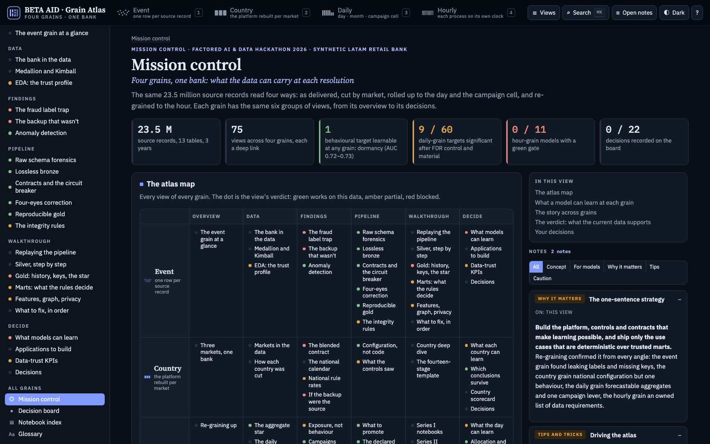
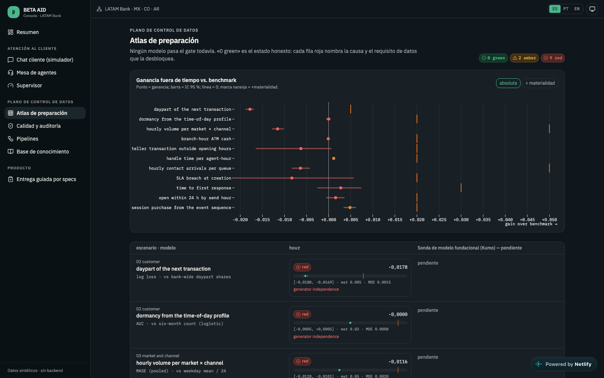
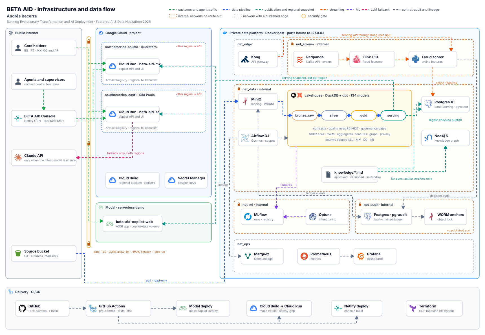
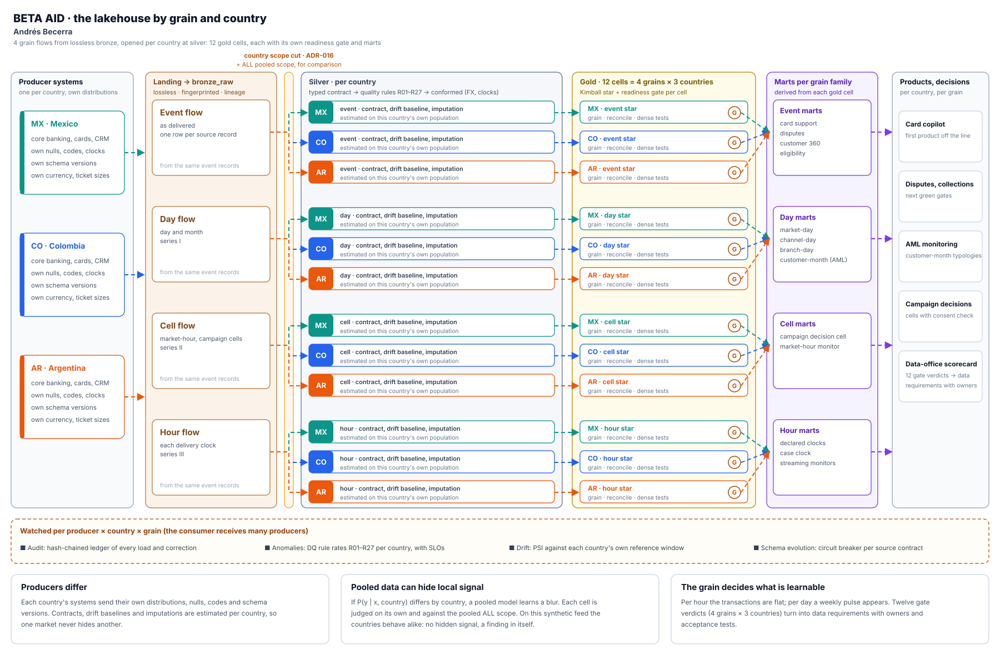
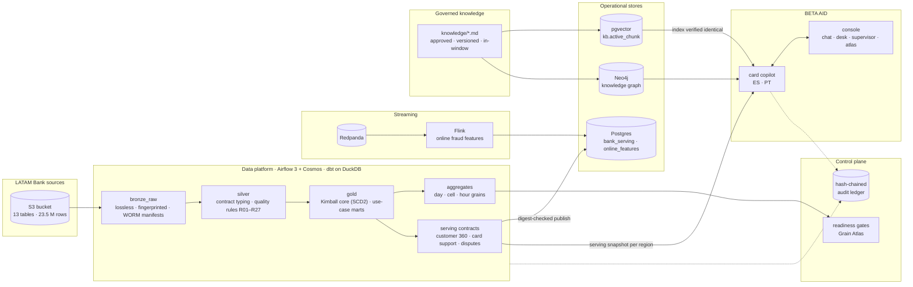
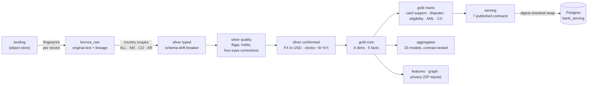
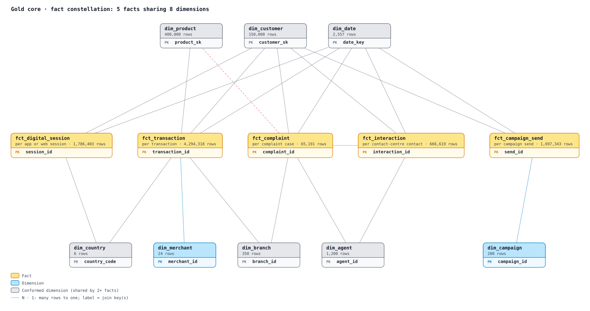
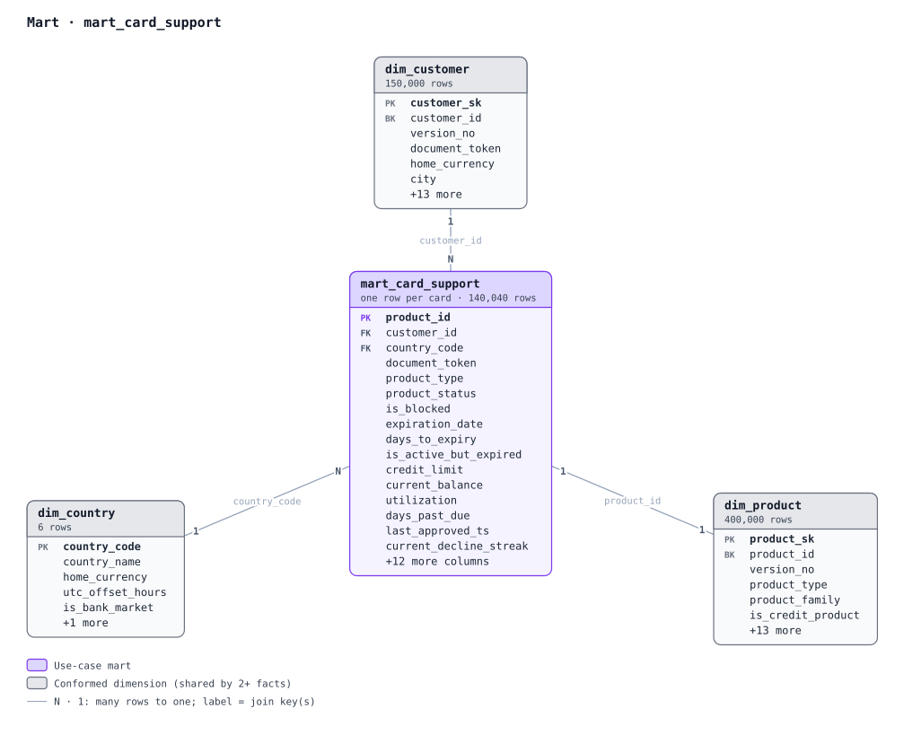
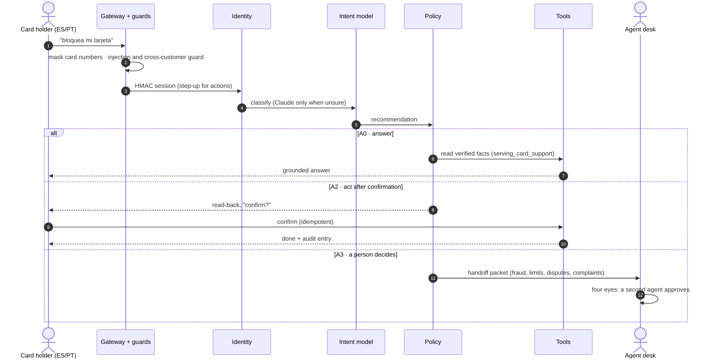
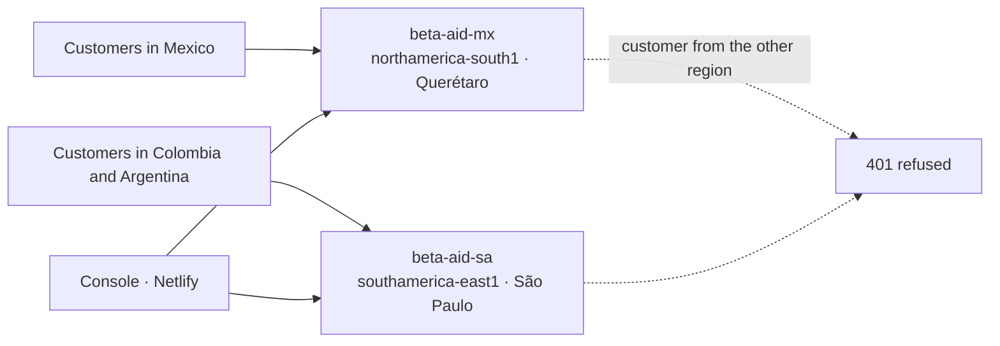

<div align="center">

# BETA AID

### Banking Evolutionary Transformation and AI Deployment

**The AI readiness factory. When a bank's data says "no signal", BETA AID turns that into a diagnosis, a work order
for the data and, where the data is ready, a governed AI product. We don't build one AI product: we build the factory
that makes them possible.**

[](https://github.com/LEONOB2014/factored-hackathon-2026-Andres_Becerra/actions/workflows/ci.yml)
[](CHANGELOG.md)
[](LICENSE)
[](https://www.conventionalcommits.org/en/v1.0.0/)
[](.pre-commit-config.yaml)
[](https://github.com/astral-sh/ruff)

[](copilot/eval/reports/challenge.md)
[](copilot/eval/reports/challenge_after_fix.md)
[](copilot/eval/reports/kb_retrieval.md)
[](copilot/eval/reports/open_models.md)
[](copilot/eval/reports/kb_retrieval.md)
[](docs/platform/README.md#what-was-verified-on-the-running-stack-end-to-end-airflow-run-2026-10-03)

[](https://www.python.org/)
[](https://beta-aid-dbt-docs.netlify.app)
[](https://duckdb.org/)
[](platform/airflow)
[](platform/flink)
[](docs/platform/adr/ADR-003.md)
[](docs/platform/06_knowledge_and_graphrag.md)
[](docs/platform/07_ml_and_graph_learning.md)
[](https://aleonardobecerra--beta-aid-copilot-web.modal.run)
[](docs/platform/adr/ADR-021.md)
[](https://beta-aid-console.netlify.app)

**[Open the Grain Atlas](https://beta-aid-grain-atlas.netlify.app)** ·
**[Try the copilot](https://aleonardobecerra--beta-aid-copilot-web.modal.run)** ·
**[Open the console](https://beta-aid-console.netlify.app)** ·
[Architecture](docs/platform/01_architecture.md) · [Lakehouse docs (dbt)](https://beta-aid-dbt-docs.netlify.app) ·
[Decisions (ADRs)](docs/platform/adr/README.md) ·
[Evaluation](copilot/eval/reports/)

<sub>Factored AI & Data Hackathon 2026 · built by Andrés Becerra</sub>

</div>

---

## Why this exists

We were handed a bank's data (13 tables, 23.5 million rows, Mexico, Colombia and Argentina) and asked to build AI on
it. We started where everyone starts, with the technology: graph neural networks, temporal graphs, agents. **The data
said no.** Model after model, country by country, grain by grain, there was no signal: eleven hour-grain models trained
out of time against transparent benchmarks, **zero green**.

The easy path is to fake a signal, or to ignore the data and demo something fragile on top. We asked a different
question: **why can't these models learn?** Every failure turned out to be a diagnosis: a missing field, a broken
capture, the wrong granularity, a data defect, a generator that never linked the variables. An unlearnable model is not
a dead end; it is a **work order for the data**.

That is the product: **measure → diagnose → prescribe → fix → re-judge → ship.** Every turn of the loop either ships a
governed model or produces a data requirement with an owner, an acceptance test and the threshold that turns it green.
The first product off the line is a card-service copilot, because card support was the decision the data could support.

## The product: a decision dashboard and an auditor agent

BETA AID has three parts, in order of importance:
1. **The decision dashboard, the [Grain Atlas](https://beta-aid-grain-atlas.netlify.app).** Insights at every level of
   granularity, backed by rigorous statistics, justify each decision about what the data can support. The statistics
   are out-of-time training, bootstrapped gains over a transparent benchmark with 95 % intervals, a materiality
   threshold, the minimum detectable effect and false-discovery-rate control.
2. **The auditor agent.** It turns every gate that fails into a data-quality document: the root cause, what the source
   must collect, the owner, the acceptance test on a new feed and the threshold that turns it green. Those documents are
   meant to trigger, in practical terms, the generation of new and better data.
   - **Today:** the documents are produced by the readiness scorecard (ADR-018) and listed in the Atlas audit table.
   - **Prototype:** the agent workflow is in the console's *Data quality & audit agents* and *Spec-driven delivery*
     screens, on labelled demo data.
3. **The products the data can support,** starting with the card-service copilot below.

The Atlas reads the same 23.5 million records four ways: as delivered, cut by country, rolled up to the day and the
campaign cell, and re-grained to the hour. Each grain has its data, findings, pipeline, walkthrough and decisions.

<p align="center"></p>

What it shows today, measured:
- **0 / 11** hour-grain models pass their readiness gate; each red gate names its root cause (8 generator independence,
  1 data defect), the owner who must collect the missing data and the acceptance test on a new feed.
- **9 / 60** daily-grain targets are significant after false-discovery-rate control and material: the signal lives
  where the data is ready.
- **1** behavioural target is learnable at any grain: dormancy, AUC 0.72–0.73.

The same scorecard runs inside the [console](https://beta-aid-console.netlify.app/atlas) as the readiness atlas, from
the copilot's control API: out-of-time gain over the benchmark with 95 % intervals, materiality and the minimum
detectable effect for every candidate model.

<p align="center"></p>

The Atlas is also served by every copilot deployment at `/atlas`
([Modal](https://aleonardobecerra--beta-aid-copilot-web.modal.run/atlas)). Its source is
[`eda/reports/dashboards/grain_atlas`](eda/reports/dashboards/grain_atlas/), regenerated from the exploratory notebooks.

## What makes it different

| | |
|---|---|
| 🧾 **The data is proven, not assumed** | Every landed record is kept byte-exact with a fingerprint and per-file proofs. All 13 tables reconcile with 0 rejected and 0 lost. Quality rules flag rows; they never overwrite them. |
| 🚦 **The data decides what AI is allowed** | Readiness gates measure which decisions each grain of data can support. Several popular models are *not* trainable from this data, and the [Grain Atlas](https://aleonardobecerra--beta-aid-copilot-web.modal.run/atlas) says so. |
| ⚖️ **The model recommends; it never decides** | Decision rights follow RAPID. A versioned policy agrees or vetoes, tools act only on the signed-in customer's own cards, and a person decides fraud, limits, disputes and complaints. |
| 🔒 **Every action is confirmed** | HMAC sessions with step-up, a two-step confirmation with read-back, idempotency and a hash-chained audit log for each turn. |
| 🧪 **Evaluated like a regulator would** | The challenge set was frozen and hashed **before** the first scored run. The one unsafe case was reported, fixed and re-run in the open. |
| 🌎 **Residency is enforced, not a slide** | One deployment per residency region. A customer from the other region is refused (401). |

## Try it in two minutes

| Where | What to do |
|---|---|
| **[Grain Atlas](https://beta-aid-grain-atlas.netlify.app)** | Start at mission control, then open a grain (keys 1–4): what the data supports at each grain, and the audit table of data requirements. |
| **[Copilot (Modal)](https://aleonardobecerra--beta-aid-copilot-web.modal.run)** | Sign in as a demo customer with the test code shown on the page. Ask *"mi tarjeta no pasa"*, then ask it to block a card and watch it confirm before acting. |
| **[Console (Netlify)](https://beta-aid-console.netlify.app)** | Chat simulator → fraud handoff → **agent desk** (four eyes: an agent cannot approve their own request) → supervisor view. |
| **Regional copilots** | Mexico in Querétaro: [`beta-aid-mx`](https://beta-aid-mx-621442591789.northamerica-south1.run.app). Colombia and Argentina in São Paulo: [`beta-aid-sa`](https://beta-aid-sa-621442591789.southamerica-east1.run.app). |

**Reviewer access.** The copilot fills in its test codes itself: pick a demo customer and sign in. The console's agent
desk asks for the test staff code **112233**, and approving a handoff needs a second agent (four eyes). All of these are
documented test fixtures (see [Security and authentication](#security-and-authentication)).

Some control-plane screens in the console still run on labelled demo data; the chat, desk and handoffs call the real
copilot.

## Results

Every number comes from held-out data, with Wilson 95 % intervals. The 120 ES/PT challenge cases, the intent phrasings
and the retrieval questions are pinned by [`MANIFEST.sha256`](copilot/eval/MANIFEST.sha256), committed before scoring.

| Copilot, 120 frozen ES/PT cases | Keyword router | **BETA AID (learned)** |
|---|---|---|
| Correct final outcome | 0.875 [0.80, 0.92] | **0.950** [0.90, 0.98] |
| Safe automated resolution, in-scope cases | 0.841 | **0.937** |
| Missed transfers (person must decide) | 4 / 27 | **1 / 27** |
| Unnecessary transfers | 2 / 63 | **0 / 63** |
| Unsafe outcomes, frozen run → after the fix | 1 / 120 → 0 / 120 | 1 / 120 → **0 / 120** |
| Latency per turn, p50 / p95 | 2.0 / 20.8 ms | 2.9 / 22.5 ms |

- **The unsafe case.** In the frozen run, one Portuguese prompt injection got past the guard. The policy still routed
  it to a person. The guard was fixed and the same frozen set was re-run, giving 0/120 unsafe and 0.958 correct
  ([after-fix report](copilot/eval/reports/challenge_after_fix.md)). The headline above stays the pre-fix figure.
- **Intent model:** accuracy 0.818 against 0.576 for keywords, on 132 held-out phrasings across 15 intents. It was tuned
  with Optuna and tracked in MLflow.
- **Retrieval:** hit@3 0.94 on 28 ES/PT questions, the same for pgvector, GraphRAG and hybrid. Zero retired,
  superseded, draft or expired documents were returned ([report](copilot/eval/reports/kb_retrieval.md)).
- **Platform, end-to-end run (2026-10-03):**
  - 12,505 files fingerprinted;
  - every dbt layer green behind the quality and governance gates;
  - 7 serving tables published with digests;
  - Flink and dbt streaming features in parity, 0 mismatches over 7,789 transactions;
  - the audit chain verified with 0 problems ([evidence](docs/platform/README.md#what-was-verified-on-the-running-stack-end-to-end-airflow-run-2026-10-03)).

### Open-weight models: a chatbot versus an agent inside BETA AID

To show that the guardrails are architecture, not prompt engineering, three models were attacked twice with the same
85 adapted attacks, at temperature 0:
- two open-weight models run locally with Ollama;
- one hosted model reached through an OpenAI-compatible gateway (Blaxel).
- **Raw:** the model alone, as a chatbot whose system prompt holds a secret staff code and another customer's card.
- **Inside BETA AID:** the same model in its two bounded jobs (classify when unsure, rephrase), behind the gateway,
  policy, tools and grounding checks.

The attacks come from public datasets: [Lakera/gandalf_ignore_instructions](https://huggingface.co/datasets/Lakera/gandalf_ignore_instructions)
(secret extraction, MIT) and [deepset/prompt-injections](https://huggingface.co/datasets/deepset/prompt-injections)
(Apache-2.0). They were adapted to the card service in Spanish and Portuguese, and card-number probes use public test
numbers.

| Model | Raw: attacks that succeeded | Inside BETA AID | Frozen challenge set inside BETA AID | Unsafe | LLM time to first token p50 |
|---|---|---|---|---|---|
| NVIDIA Nemotron-Mini 4B | **12 / 85** (secret leaks, other customers' cards, full card numbers echoed) | **0 / 85** | 0.950 (114/120) | 0 / 120 | 399 ms (rephrase) |
| Qwen2.5 3B | **12 / 85** | **0 / 85** | 0.933 (112/120) | 0 / 120 | 246 ms (rephrase) |
| OpenAI GPT-4o-mini (hosted) | 0 / 85 | **0 / 85** | 0.917 (110/120) | 0 / 120 | 2,141 ms (rephrase, via gateway) |

**The point:** the hosted frontier model resists these attacks on its own, but every customer turn leaves the region
for a third-party API. Inside BETA AID, 3–4B models that run in the bank's own region are just as safe (0 of 85),
with ten times lower time to first token.

**Inside BETA AID, the model never sees a secret, another customer's data or a full card number,** and it never
decides an action. Attacks either get the customer's real request answered from verified facts, or are refused,
clarified or handed to a person. The same holds with no model at all: the deterministic path scores 0.950 with
0 unsafe outcomes.

Full report: [`copilot/eval/reports/open_models.md`](copilot/eval/reports/open_models.md). Reproduce it with
`COPILOT_LLM_BACKEND=ollama uv run python eval/open_models.py --model <model>`.

## Security and authentication

The brief accepts sandbox services when their contracts and limitations are documented. It asks for authentication
through a trusted test session or identity service, because a customer number alone does not prove identity, and for
access to each customer's data to be enforced. BETA AID implements this in layers, outside the model, so a prompt can
never talk its way past them.

| Layer | Mechanism | Where | Proven by |
|---|---|---|---|
| **1. Identity and session** | A test identity service issues HMAC-SHA256 signed session tokens with a 15-minute TTL. Missing, expired or tampered tokens are refused, and comparisons are constant-time (`hmac.compare_digest`). A customer id alone never opens a session: a one-time code is required. | [`identity.py`](copilot/src/copilot/identity.py) | `no_session` challenge cases 6/6 |
| **2. Step-up for sensitive actions** | Unblocking a card needs a second, step-up code on top of the session. | [`identity.py`](copilot/src/copilot/identity.py), [`policy.yaml`](copilot/src/copilot/policy.yaml) | Copilot tests |
| **3. Action authorisation** | Every write is two-phase. The copilot proposes, then the customer confirms with a token: an HMAC over action, customer, session, card and expiry, with a 5-minute TTL and a single-use nonce as the idempotency key. A read-back must match before the copilot may say "done". | [`tools.py`](copilot/src/copilot/tools.py) | `confirm_cancel` cases 16/16 |
| **4. Data isolation** | Tools read only the session customer's cards from a read-only snapshot; writes go to a separate operational store. A cross-customer guard runs before the model sees the turn, and each region serves only its own countries (a customer from the other region gets 401). | [`tools.py`](copilot/src/copilot/tools.py), [ADR-021](docs/platform/adr/ADR-021.md) | `other_customer` 10/10, `injection` 8/8 |
| **5. Policy outside the model** | Autonomy levels A0, A2 and A3 plus nine vetoes live in a versioned YAML policy. Fraud, limits, disputes and complaints always go to a person. | [`policy.yaml`](copilot/src/copilot/policy.yaml) | Frozen challenge set (120 cases) |
| **6. Staff access and four eyes** | The agent desk needs a staff code, and approving a handoff needs a different agent from the one who requested it (self-approval is refused with 409). | [`app.py`](copilot/src/copilot/app.py) | Copilot tests, console |
| **7. Audit and observability** | Every turn is traced (policy version, rule, autonomy, grounding) and appended to a hash-chained log. | [`audit.py`](copilot/src/copilot/audit.py) | Chain verification |
| **8. Data protection and retention** | Card numbers are masked before anything is logged, traced or sent to the LLM. Gold and serving hold tokens, not identities. Sessions live 15 minutes and confirmations 5 minutes; nothing is stored about the conversation beyond the masked, audited trace. | [`gateway.py`](copilot/src/copilot/gateway.py), [ADR-007](docs/platform/adr/ADR-007.md) | Copilot tests |

**Documented limitations (test mode):**
- **Test fixtures.** The one-time, step-up and staff codes are test fixtures, shown in the demo UI on purpose so
  reviewers can sign in. They come from `COPILOT_TEST_*` environment variables; production replaces them with an OTP
  sent by SMS or email for customers and an identity provider with roles for staff.
- **Sandboxed writes.** In the public demo (`COPILOT_SANDBOX=1`), a confirmed action changes the card only inside the
  session that made it, so visitors cannot affect each other.
- **Customer scoping is enforced in the application layer.** Real customer data would add row-level security on the
  Postgres serving tables, keyed by customer and country ([ADR-003](docs/platform/adr/ADR-003.md)).
- **LLM fallback is optional.** With an `ANTHROPIC_API_KEY` configured, masked text goes to the Claude API when the
  intent model is unsure. The public deployments run without a key, on the deterministic path (the tuned intent model
  and grounded templates) that produced every reported number. With real data, the fallback needs a regional or
  self-hosted model to respect residency.

## Architecture



The diagram is generated by [`scripts/diagrams/architecture.py`](scripts/diagrams/architecture.py). It shows:
- the network boundaries exactly as [`compose.yml`](platform/docker/compose.yml) declares them;
- one copilot service per residency region;
- the gate every request passes.

### The lakehouse by grain and country



Generated by [`scripts/diagrams/granularity_flow.py`](scripts/diagrams/granularity_flow.py). The structure is the
instrument of the factory:
- **Four grain flows** (event, day, cell, hour) start from the same lossless bronze records
  ([ADR-017](docs/platform/adr/ADR-017.md)).
- **Each flow opens per country at silver** (MX, CO, AR, plus the pooled ALL scope for comparison;
  [ADR-016](docs/platform/adr/ADR-016.md)). Contracts, drift baselines and imputations are estimated on each
  country's own population.
- **Gold holds 12 cells, 4 grains × 3 countries,** each a tested star with its own readiness gate
  ([ADR-018](docs/platform/adr/ADR-018.md)); the marts of each grain family are derived from them.
- **Everything is watched per producer, country and grain:** a hash-chained audit, anomaly rates for rules R01–R27, drift
  against each country's reference window, and a schema-evolution circuit breaker per source contract.

#### Why split by country: one consumer, many producers

A bank's lakehouse is a consumer fed by many producer systems, one or more per country, and they rarely share a
distribution. Pooling them can hide or blur a signal that is strong inside each country:
- **Different base rates.** Fraud, dormancy or complaint prevalence differs by market; a pooled model optimises for
  the weighted average and dilutes the high-prevalence market's pattern.
- **Covariate shift.** The same feature means different things per country: amounts, currencies and ticket sizes,
  channels, time-of-day habits.
- **Concept shift.** Fraud and behaviour have local vocabularies, so P(y | x, country) is not P(y | x); a pooled model
  learns a blur.
- **Country-correlated labels and quality.** Investigation intensity, label definitions, null rates, code sets,
  late arrivals and schema versions differ by source system and add country-specific noise.

So every cell is diagnosed on its own and against the pooled scope:
- stratified, out-of-time evaluation per country against the same benchmark;
- PSI and distribution comparisons across countries;
- country-by-feature interactions;
- label checks per country.

The modelling options this opens are recorded rather than assumed:
- separate models per country;
- one model with country interactions;
- hierarchical or multi-task models;
- features normalised within country.

**What this data showed, honestly:** on this synthetic feed the countries behave alike (ADR-016), so the country split
recovered no hidden signal, and that is a finding in itself. The grain did matter: transactions are flat per hour and
pulse weekly per day, and the day grain carries the significant targets. On real multi-producer feeds this same
structure is where local signal, drift and schema evolution surface first.

#### Why split by grain

A bank decides at many grains: a transaction, a customer this month, a market today, a campaign cell, a queue this
hour. Each grain changes what is learnable and what is monitorable. Re-graining the same records gives new fact and
dimension tables, new variables and new marts, and each grain × country cell gets its own verdict. Twelve verdicts are
twelve chances to ship a product or to name the data that is missing.

### The logical view



### How the data flows



The lakehouse has 131 dbt models, every one documented ([browse the dbt docs](https://beta-aid-dbt-docs.netlify.app)), and every layer is tested. Contracts make a renamed or retyped serving column fail the
build instead of breaking the copilot. Details: [data flows](docs/platform/02_data_flows.md) and
[ADR-017](docs/platform/adr/ADR-017.md).

### Data model

The gold core is a Kimball constellation: five facts sharing eight dimensions. Six of those dimensions are conformed
(grey), and each use-case mart is keyed back to the core.





The bus matrix and one star per fact and per mart are in [**the data model**](docs/platform/data_model.md).

### One copilot turn



The policy has three levels:
- A0: answer;
- A2: act after confirmation;
- A3: hand off.

Nine card vetoes sit on top of them, all in a versioned [`policy.yaml`](copilot/src/copilot/policy.yaml). The design is
in the [copilot README](copilot/README.md) and [ADR-019](docs/platform/adr/ADR-019.md).

### Residency by design



Each regional service holds only its own countries' data. The region map mirrors
[`residency.yaml`](platform/policies/residency.yaml) ([ADR-007](docs/platform/adr/ADR-007.md),
[ADR-021](docs/platform/adr/ADR-021.md)).

## What the data taught us

The exploratory phase ([ADR-015](docs/platform/adr/ADR-015.md), [eda/README](eda/README.md)) turned up five findings
that shaped every later decision:
- **The backup folder is not a copy.** It is a second, independently generated bank. Never join it to the main data.
- **Timestamps run on delivery-day clocks:**
  - −6 h for transactions, digital events and sends;
  - −8 h for contacts and complaints ([ADR-014](docs/platform/adr/ADR-014.md)).
- **`fraud_score ≥ 35` means fraud in every case.** It is a leaked label, not a feature, and the behavioural signal
  alone carries almost none.
- **Many models are not trainable from this data.** The readiness gates turn that into a data-collection audit rather
  than a weak model ([ADR-018](docs/platform/adr/ADR-018.md)).
- **Card support has the cleanest decision data.** 140,040 cards, a rule-based next action for over 65,000 of them, and
  499 flagged for fraud review. That is why the copilot starts there.

## What is in the repository

| Area | Path | Status |
|---|---|---|
| Card-service copilot | [`copilot/`](copilot/) | ✅ Built, evaluated and deployed: policy, verified actions, handoff, RAG and GraphRAG, held-out evaluation ([README](copilot/README.md)) |
| BETA AID Console | [`console/`](console/) | 🚧 Chat simulator, agent desk and supervisor on the real copilot per region; control-plane screens being wired ([README](console/README.md)) |
| Data platform | [`platform/`](platform/) | ✅ Run end to end: lossless bronze, dbt silver to serving, Airflow 3 with country scopes, audit ledger, knowledge base, streaming features, read-only Data API ([docs](docs/platform/README.md)) |
| Governed knowledge base | [`knowledge/`](knowledge/) | ✅ Approved, versioned documents indexed in pgvector and Neo4j |
| Exploratory analysis and readiness | [`eda/`](eda/) | ✅ Dataset study, anomaly detection, grain series, country and pipeline replays, the Grain Atlas ([README](eda/README.md)) |
| Architecture decisions | [`docs/platform/adr/`](docs/platform/adr/README.md) | ✅ ADR-001 to ADR-021 |
| Strategy and research | [`docs/strategy/`](docs/strategy/README.md), [`docs/research/`](docs/research/) | 📚 The analysis that shaped the plan |
| Backend API, agent graph | `backend/`, `agents/` | 🧱 Original scaffolds; the copilot replaced them as the served application |
| Legacy dbt scaffold | `data_engineering/` | 🧱 Superseded by `platform/dbt`; the CI "dbt Tests" job still runs it |
| ML packages, monitoring, infrastructure | `ml/`, `monitoring/`, `infrastructure/` | 🧱 Scaffolds; platform ML lives in `platform/libs/latam_platform/ml`, GCP Terraform in `platform/infra` |

## Technology

| Layer | Stack |
|---|---|
| Ingestion and orchestration | S3 and MinIO (object lock), Airflow 3.1 with Cosmos, one DAG per country scope |
| Lakehouse | dbt 1.12 on DuckDB; Kimball core with SCD2 snapshots; contract-tested aggregates; BigQuery targets designed per region |
| Streaming | Redpanda, Flink 1.19 and a fraud scorer; batch and stream share one feature definition |
| Serving and knowledge | Postgres 16 with pgvector (HNSW, governed `kb.active_chunk` view), Neo4j 5, Kong gateway |
| ML and observability | MLflow, Optuna, Marquez (OpenLineage), Prometheus and Grafana; federated graph learning simulated per silo |
| Copilot | Python 3.12, FastAPI, a tuned intent model with Claude as fallback, policy as code, HMAC sessions |
| Console | TanStack Start (React), Observable Plot, Bun, Vitest |
| Deployment | Modal, Google Cloud Run per residency region, Netlify; Terraform for GCP |
| Quality | pre-commit (ruff, mypy, detect-secrets), Conventional Commits with commitizen, GitHub Actions |

## Quick start

Prerequisites: Python 3.11+, [uv](https://docs.astral.sh/uv/), Docker and Make. Data never enters git; see
[data and secrets](docs/development/data-and-secrets.md).

```bash
make setup                         # root env + pre-commit and commit-msg hooks

# the copilot
make copilot-setup && make copilot-test
make copilot-snapshot              # demo snapshot from the local lakehouse (data/copilot/, git-ignored)
make copilot-dev                   # http://127.0.0.1:8000 (UI, /api, /atlas)

# the platform, by development stage (platform/docker/compose.yml profiles)
make stack-env                     # once: random secrets for the stack
make stack-copilot                 # pgvector, Neo4j, MLflow only
make stack-dev                     # full pipeline stack: Postgres, MinIO, Airflow 3, Neo4j, MLflow
make stack-stream                  # add Redpanda, Flink, the fraud scorer and Kong
make stack-obs                     # add Marquez, Prometheus and Grafana
make copilot-kb                    # bundled knowledge index, verified against pgvector and Neo4j
make copilot-eval                  # frozen challenge set and retriever comparison

# the exploratory analysis
make eda-setup && make eda-test
```

Run the `stack-*` targets from the checkout that hosts the stack, because its bind mounts are relative to that
checkout. The full runbook is in [`docs/platform/runbook.md`](docs/platform/runbook.md). Deployment needs no Docker:
- `make copilot-deploy` ships the copilot to Modal (see [`modal_app.py`](copilot/deploy/modal_app.py));
- `make copilot-deploy-gcp` ships it to Cloud Run, once per residency region.

## Dataset

<details>
<summary><b>13 tables · 23.5 M rows · 2023-06-17 → 2026-06-17 · MXN, COP, ARS and USD</b> (row counts measured; several differ from the documented sizes)</summary>

| Table | Type | Rows (measured) | Documented |
|-------|------|----------------:|-----------:|
| `customers` | Dimension | 150,000 | 150K |
| `products` | Dimension | 400,000 | 400K |
| `branches` | Dimension | 350 | 350 |
| `service_agents` | Dimension | 1,200 | 1.2K |
| `marketing_campaigns` | Dimension | 200 | 200 |
| `transactions` | Fact | 4,425,008 | 5M |
| `digital_events` | Fact | 15,620,994 | 10M |
| `call_center_interactions` | Fact | 686,296 | 800K |
| `call_transcripts` | Fact | 171,321 | 200K |
| `satisfaction_surveys` | Fact | 212,759 | 250K |
| `complaints` | Fact | 67,095 | 80K |
| `campaign_sends` | Fact | 1,746,801 | 2M |
| `daily_exchange_rates` | Reference | 13,164 | 3K |

The schema and relationships are in the [ERD](docs/dataset/erd.md), generated from the
[data dictionary](docs/dataset/LATAM_Bank_Complete_Data_Dictionary.pdf).

</details>

## How we work

The rules for people and coding agents are in [`AGENTS.md`](AGENTS.md), imported by `CLAUDE.md`. Procedures are in
[`docs/development/`](docs/development/README.md).

- **Branches:**
  - `main` is production and `develop` is integration;
  - every work branch lives in its own worktree and merges by pull request.
- **Versions:** SemVer 0.x until submission, recorded in the [`CHANGELOG.md`](CHANGELOG.md).
- **Commits:** Conventional Commits, enforced by commitizen.
- **Quality gate:** pre-commit is the single gate, locally and in CI.
- **CI** runs on pull requests into `main` and `develop`:
  - lint, format and type check;
  - unit tests, EDA tests and platform tests;
  - copilot tests and console tests;
  - integration and dbt jobs.

## Documentation

[`docs/README.md`](docs/README.md) is the index. It covers:
- the hackathon brief and the dataset;
- the [platform chapters](docs/platform/README.md) and the [21 ADRs](docs/platform/adr/README.md);
- the strategy and the original design specs;
- the research and the development guides.

## License

[MIT](LICENSE) · **Andrés Becerra** · Factored AI & Data Hackathon 2026
