# LATAM Bank – Entity Relationship Diagram

_Generated by `eda/scripts/generate_erd.py` from `docs/dataset/LATAM_Bank_Complete_Data_Dictionary.pdf`. Do not edit by hand._

Legend: `PK` primary key · `FK` foreign key · `UK` unique. Solid lines = documented foreign keys (`||` = mandatory, `|o` = nullable FK). Dotted = logical join without a declared FK.

```mermaid
erDiagram
    customers {
        varchar customer_id PK "NOT NULL"
        varchar document_number UK "NOT NULL"
        varchar document_type "NOT NULL"
        varchar first_name "NOT NULL"
        varchar last_name "NOT NULL"
        date date_of_birth "NOT NULL"
        varchar gender
        varchar email
        varchar mobile_phone
        varchar landline_phone
        varchar address
        varchar city "NOT NULL"
        varchar state "NOT NULL"
        varchar country "NOT NULL"
        varchar postal_code
        varchar detected_accent
        varchar segment "NOT NULL"
        integer credit_score
        decimal estimated_monthly_income
        varchar occupation
        varchar marital_status
        varchar education_level
        timestamp registration_date "NOT NULL"
        varchar registration_branch_id FK "NOT NULL"
        varchar customer_status "NOT NULL"
        timestamp last_updated "NOT NULL"
        boolean accepts_marketing "NOT NULL"
    }
    products {
        varchar product_id PK "NOT NULL"
        varchar customer_id FK "NOT NULL"
        varchar product_type "NOT NULL"
        varchar product_number UK "NOT NULL"
        varchar currency "NOT NULL"
        decimal current_balance "NOT NULL"
        decimal credit_limit
        decimal interest_rate
        date opening_date "NOT NULL"
        date expiration_date
        varchar opening_branch_id FK "NOT NULL"
        varchar product_status "NOT NULL"
        varchar opening_channel "NOT NULL"
        boolean has_linked_app "NOT NULL"
        integer days_past_due
        timestamp last_transaction_date
        timestamp last_updated "NOT NULL"
    }
    branches {
        varchar branch_id PK "NOT NULL"
        varchar branch_code UK "NOT NULL"
        varchar branch_name "NOT NULL"
        varchar branch_type "NOT NULL"
        varchar address "NOT NULL"
        varchar city "NOT NULL"
        varchar state "NOT NULL"
        varchar country "NOT NULL"
        varchar postal_code
        varchar geographic_zone "NOT NULL"
        varchar phone "NOT NULL"
        varchar email
        time opening_time "NOT NULL"
        time closing_time "NOT NULL"
        boolean has_atms "NOT NULL"
        integer atm_count
        boolean has_teller_windows "NOT NULL"
        integer teller_window_count
        decimal latitude
        decimal longitude
        date branch_opening_date "NOT NULL"
        varchar branch_status "NOT NULL"
    }
    service_agents {
        varchar agent_id PK "NOT NULL"
        varchar employee_code UK "NOT NULL"
        varchar first_name "NOT NULL"
        varchar last_name "NOT NULL"
        varchar email "NOT NULL"
        varchar phone
        varchar native_accent "NOT NULL"
        varchar country_of_origin "NOT NULL"
        varchar assigned_branch_id FK
        varchar agent_type "NOT NULL"
        varchar experience_level "NOT NULL"
        varchar languages "NOT NULL"
        varchar specialty
        date hire_date "NOT NULL"
        decimal avg_csat
        integer total_monthly_interactions
        varchar agent_status "NOT NULL"
        varchar work_shift "NOT NULL"
    }
    marketing_campaigns {
        varchar campaign_id PK "NOT NULL"
        varchar campaign_name "NOT NULL"
        text description
        varchar campaign_type "NOT NULL"
        varchar campaign_objective "NOT NULL"
        varchar promoted_product
        varchar target_segment
        varchar target_country
        date start_date "NOT NULL"
        date end_date "NOT NULL"
        decimal budget
        varchar campaign_status "NOT NULL"
        decimal expected_conversion_rate
    }
    transactions {
        varchar transaction_id PK "NOT NULL"
        timestamp transaction_date "NOT NULL"
        date process_date "NOT NULL, partition key"
        varchar product_id FK "NOT NULL"
        varchar customer_id FK "NOT NULL"
        varchar transaction_type "NOT NULL"
        varchar transaction_category
        decimal amount "NOT NULL"
        varchar currency "NOT NULL"
        decimal amount_usd
        varchar channel "NOT NULL"
        varchar branch_id FK
        varchar merchant_name
        varchar merchant_category
        varchar transaction_country "NOT NULL"
        varchar transaction_city
        varchar transaction_status "NOT NULL"
        varchar response_code
        boolean is_fraud "NOT NULL"
        decimal fraud_score
        decimal latitude
        decimal longitude
    }
    call_center_interactions {
        varchar interaction_id PK "NOT NULL"
        timestamp interaction_date "NOT NULL"
        date process_date "NOT NULL, partition key"
        varchar customer_id FK "NOT NULL"
        varchar agent_id FK
        varchar interaction_type "NOT NULL"
        varchar channel "NOT NULL"
        varchar contact_reason "NOT NULL"
        varchar reason_category "NOT NULL"
        integer duration_seconds
        integer wait_time_seconds
        boolean was_resolved
        boolean requires_followup "NOT NULL"
        varchar detected_sentiment
        decimal sentiment_score
        varchar customer_detected_accent
        varchar agent_used_accent
        boolean was_escalated "NOT NULL"
        varchar mentioned_products
        boolean has_transcript "NOT NULL"
        boolean has_recording "NOT NULL"
    }
    call_transcripts {
        varchar transcript_id PK "NOT NULL"
        varchar interaction_id FK "NOT NULL"
        date process_date "NOT NULL, partition key"
        varchar customer_id FK "NOT NULL"
        varchar agent_id FK "NOT NULL"
        text full_text "NOT NULL"
        text customer_text
        text agent_text
        varchar detected_language "NOT NULL"
        varchar detected_accent
        decimal accent_confidence
        varchar detected_keywords
        text mentioned_entities
        varchar detected_intents
        varchar main_topics
        varchar transcription_model "NOT NULL"
        varchar audio_quality
        integer duration_seconds "NOT NULL"
    }
    satisfaction_surveys {
        varchar survey_id PK "NOT NULL"
        timestamp survey_date "NOT NULL"
        date process_date "NOT NULL, partition key"
        varchar interaction_id FK
        varchar customer_id FK "NOT NULL"
        varchar agent_id FK
        varchar survey_type "NOT NULL"
        varchar send_channel "NOT NULL"
        integer main_score "NOT NULL"
        varchar nps_category
        text question_1_text
        integer question_1_response
        text question_2_text
        integer question_2_response
        text question_3_text
        integer question_3_response
        text open_comments
        varchar comment_sentiment
        decimal response_time_hours
        decimal campaign_response_rate
    }
    digital_events {
        varchar event_id PK "NOT NULL"
        timestamp event_date "NOT NULL"
        date process_date "NOT NULL, partition key"
        varchar customer_id FK
        varchar session_id "NOT NULL"
        varchar event_type "NOT NULL"
        varchar event_category "NOT NULL"
        varchar channel "NOT NULL"
        varchar platform
        varchar browser
        varchar app_version
        varchar page_url
        varchar page_title
        varchar action
        varchar element_id
        varchar product_id FK
        decimal event_value
        integer duration_seconds
        varchar ip_address
        varchar ip_country
        varchar ip_city
        boolean is_mobile "NOT NULL"
        varchar referrer
        varchar utm_source
        varchar utm_medium
        varchar utm_campaign
    }
    complaints {
        varchar complaint_id PK "NOT NULL"
        timestamp creation_date "NOT NULL"
        date process_date "NOT NULL, partition key"
        varchar customer_id FK "NOT NULL"
        varchar case_type "NOT NULL"
        varchar category "NOT NULL"
        varchar subcategory
        varchar reception_channel "NOT NULL"
        varchar affected_product_id FK
        varchar related_branch_id FK
        varchar origin_interaction_id FK
        text description "NOT NULL"
        decimal claimed_amount
        varchar currency
        varchar priority "NOT NULL"
        varchar status "NOT NULL"
        varchar assigned_agent_id FK
        timestamp assignment_date
        timestamp first_response_date
        timestamp resolution_date
        timestamp closing_date
        boolean sla_breached "NOT NULL"
        integer resolution_days
        text resolution
        decimal compensation_granted
        integer resolution_satisfaction
        boolean is_repeat_complainer "NOT NULL"
    }
    campaign_sends {
        varchar send_id PK "NOT NULL"
        timestamp send_date "NOT NULL"
        date process_date "NOT NULL, partition key"
        varchar campaign_id FK "NOT NULL"
        varchar customer_id FK "NOT NULL"
        varchar send_channel "NOT NULL"
        varchar template_used
        varchar subject
        varchar send_status "NOT NULL"
        boolean was_delivered "NOT NULL"
        boolean was_opened
        timestamp open_date
        boolean was_clicked
        timestamp click_date
        integer click_count
        boolean had_conversion "NOT NULL"
        timestamp conversion_date
        decimal conversion_value
        varchar open_device
        varchar open_country
        varchar failure_reason
        decimal send_cost
    }
    daily_exchange_rates {
        date date PK "NOT NULL"
        varchar source_currency PK "NOT NULL"
        varchar target_currency PK "NOT NULL"
        decimal exchange_rate "NOT NULL"
        decimal buy_rate
        decimal sell_rate
        varchar source
    }

    customers ||--o{ products : "customer_id"
    customers ||--o{ transactions : "customer_id"
    customers ||--o{ call_center_interactions : "customer_id"
    customers ||--o{ call_transcripts : "customer_id"
    customers ||--o{ satisfaction_surveys : "customer_id"
    customers |o--o{ digital_events : "customer_id"
    customers ||--o{ complaints : "customer_id"
    customers ||--o{ campaign_sends : "customer_id"
    branches ||--o{ customers : "registration_branch_id"
    branches ||--o{ products : "opening_branch_id"
    branches |o--o{ service_agents : "assigned_branch_id"
    branches |o--o{ transactions : "branch_id"
    branches |o--o{ complaints : "related_branch_id"
    service_agents |o--o{ call_center_interactions : "agent_id"
    service_agents ||--o{ call_transcripts : "agent_id"
    service_agents |o--o{ satisfaction_surveys : "agent_id"
    service_agents |o--o{ complaints : "assigned_agent_id"
    products ||--o{ transactions : "product_id"
    products |o--o{ digital_events : "product_id"
    products |o--o{ complaints : "affected_product_id"
    marketing_campaigns ||--o{ campaign_sends : "campaign_id"
    call_center_interactions ||--o{ call_transcripts : "interaction_id"
    call_center_interactions |o--o{ satisfaction_surveys : "interaction_id"
    call_center_interactions |o--o{ complaints : "origin_interaction_id"
    daily_exchange_rates }o..o{ transactions : "currency + date (logical join)"
```

## Tables

| Table | Kind | Documented rows | Source | Partition | Columns | Description |
|---|---|---:|---|---|---:|---|
| `customers` | Dimension | 150,000 | Core Banking | monthly_snapshot | 27 | Bank customer dimension table |
| `products` | Dimension | 400,000 | Core Banking | monthly_snapshot | 17 | Active financial products of customers |
| `branches` | Dimension | 350 | Internal | full_snapshot | 22 | Physical bank branches |
| `service_agents` | Dimension | 1,200 | Internal | monthly_snapshot | 18 | Customer service agents |
| `marketing_campaigns` | Dimension | 200 | Internal | full_snapshot | 13 | Bank marketing campaigns |
| `transactions` | Fact | 5,000,000 | Core Banking | daily | 22 | Daily financial transactions |
| `call_center_interactions` | Fact | 800,000 | Contact Center | daily | 21 | Call center interactions with customers |
| `call_transcripts` | Fact | 200,000 | Contact Center | daily | 18 | Call center call transcripts |
| `satisfaction_surveys` | Fact | 250,000 | Contact Center | daily | 20 | Post-interaction satisfaction surveys (CSAT, NPS) |
| `digital_events` | Fact | 10,000,000 | Digital Banking | daily | 26 | Digital channel interaction events (mobile app, web) |
| `complaints` | Fact | 80,000 | PQR | daily | 27 | Complaints and claims system (PQR) |
| `campaign_sends` | Fact | 2,000,000 | Internal | daily | 22 | Individual marketing campaign sends |
| `daily_exchange_rates` | Reference | 3,000 | Reference | daily | 7 | Daily exchange rates for currency conversion |

## Foreign keys

| Child column | Parent | Nullable |
|---|---|---|
| `products.customer_id` | `customers.customer_id` | no |
| `transactions.customer_id` | `customers.customer_id` | no |
| `call_center_interactions.customer_id` | `customers.customer_id` | no |
| `call_transcripts.customer_id` | `customers.customer_id` | no |
| `satisfaction_surveys.customer_id` | `customers.customer_id` | no |
| `digital_events.customer_id` | `customers.customer_id` | yes |
| `complaints.customer_id` | `customers.customer_id` | no |
| `campaign_sends.customer_id` | `customers.customer_id` | no |
| `customers.registration_branch_id` | `branches.branch_id` | no |
| `products.opening_branch_id` | `branches.branch_id` | no |
| `service_agents.assigned_branch_id` | `branches.branch_id` | yes |
| `transactions.branch_id` | `branches.branch_id` | yes |
| `complaints.related_branch_id` | `branches.branch_id` | yes |
| `call_center_interactions.agent_id` | `service_agents.agent_id` | yes |
| `call_transcripts.agent_id` | `service_agents.agent_id` | no |
| `satisfaction_surveys.agent_id` | `service_agents.agent_id` | yes |
| `complaints.assigned_agent_id` | `service_agents.agent_id` | yes |
| `transactions.product_id` | `products.product_id` | no |
| `digital_events.product_id` | `products.product_id` | yes |
| `complaints.affected_product_id` | `products.product_id` | yes |
| `campaign_sends.campaign_id` | `marketing_campaigns.campaign_id` | no |
| `call_transcripts.interaction_id` | `call_center_interactions.interaction_id` | no |
| `satisfaction_surveys.interaction_id` | `call_center_interactions.interaction_id` | yes |
| `complaints.origin_interaction_id` | `call_center_interactions.interaction_id` | yes |

## Modelling notes

- **Grain**: facts are one row per event (`transaction_id`, `event_id`, `interaction_id`, …).
  `customers` is the hub: every fact table references it.
- **Contact-center chain**: `call_center_interactions` → `call_transcripts` (1:0..1,
  `has_transcript`), → `satisfaction_surveys` (0..n), ← `complaints.origin_interaction_id`.
- **Not declared as FKs**: `call_center_interactions.mentioned_products` is a comma-separated
  list of `product_id`; `digital_events.utm_campaign` and `campaign_sends` relate loosely to
  marketing; `daily_exchange_rates` joins on (`date`, currency pair) with
  `transactions.process_date` / `currency`.
- **Composite PK**: `daily_exchange_rates (date, source_currency, target_currency)`.
- **Partitioning**: fact tables are partitioned by `process_date` (`year=/month=/day=`).
  `*_date` timestamps can fall on a later day than `process_date` (late arrivals).
- **Known deviations from the dictionary** are tracked in `eda/reports/eda_overview.md`.
