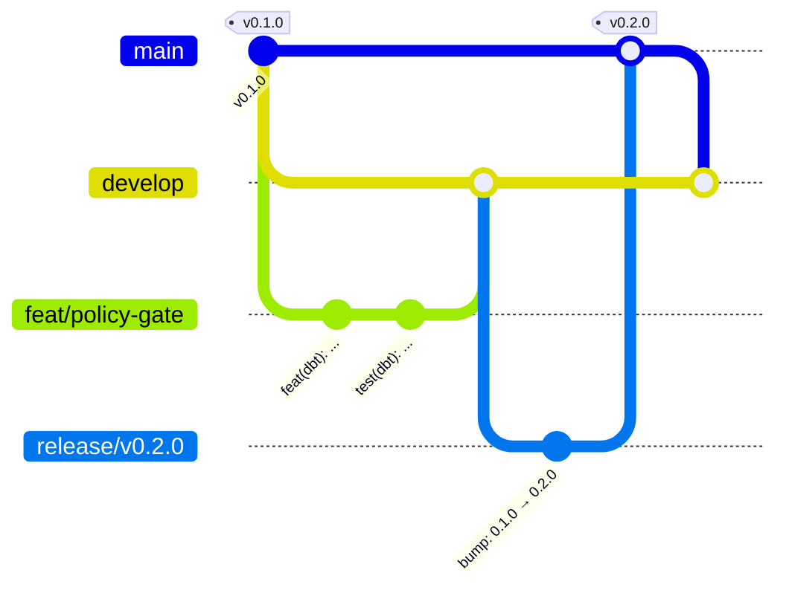

# Git workflow

The rules are in [`AGENTS.md`](../../AGENTS.md); this page is the step-by-step version.

## Branches at a glance



| Branch | Starts from | Merges into | Lifetime |
|---|---|---|---|
| `main` | — | — | permanent, production |
| `develop` | `main` | — | permanent, integration |
| `<type>/<desc>` (feat, fix, docs, test, refactor, perf, build, ci, chore) | `develop` | `develop` | under a day of work |
| `release/vX.Y.Z` | `develop` | `main` | hours |
| `hotfix/<desc>` | `main` | `main`, then `develop` | hours |

## Start a piece of work

```bash
cd antigravity                                  # the main checkout, always on main
git fetch origin
git pull --ff-only                              # keep main current; never commit here
git worktree add -b feat/policy-gate ../antigravity-worktrees/feat-policy-gate origin/develop
cd ../antigravity-worktrees/feat-policy-gate
ln -s ../../antigravity/data data               # shared dataset (git-ignored)
make setup                                      # or: make eda-setup, per area
```

Worktree directory names replace the `/` of the branch with `-`. Hooks live in the shared
`.git`, so installing them once covers every worktree.

## While working

- Commit small, self-contained changes; every commit must pass the hooks on its own.
- Keep the branch current with `develop`: `git fetch origin && git merge origin/develop`
  (merge, not rebase, once the branch has been pushed).
- If the work grows beyond a day, split it: land what is done behind a PR and continue on a
  new branch.

## Publish and merge

1. Ask the maintainer to approve the push, then `git push -u origin <branch>`.
2. `gh pr create --base develop` with a Conventional Commit title and the PR template.
3. Wait for CI; fix failures with new commits on the same branch (each push approved again).
4. Merge (`gh pr merge --merge` or `--squash`, never `--delete-branch`).
5. Clean up the worktree, keep the branch:

```bash
cd ../../antigravity
git worktree remove ../antigravity-worktrees/feat-policy-gate
git fetch origin
```

## Stacked work

If a branch needs another unmerged branch, base it on that branch, open its PR against it,
and retarget the PR to `develop` (`gh pr edit <n> --base develop`) **before** merging the
base: CI only runs on PRs into `develop` or `main`, and a deleted base closes stacked PRs.

## Recovering

- Committed on the wrong branch: `git branch <new>` at that commit, then reset the wrong
  branch only if it was never pushed; otherwise revert by PR.
- A hook failed and modified files: inspect the change, re-stage, commit again. If
  `detect-secrets` rewrote `.secrets.baseline` because line numbers moved, re-stage it with
  the change.
- `pre-commit` refuses to run because `.pre-commit-config.yaml` has unstaged edits: stage
  or commit that file first.
