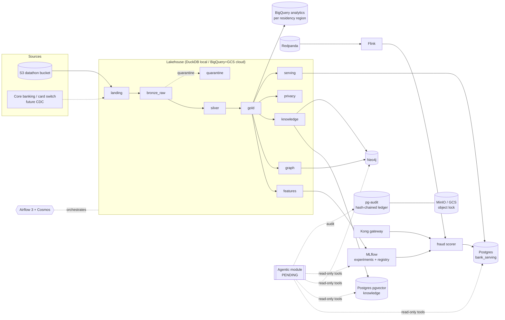
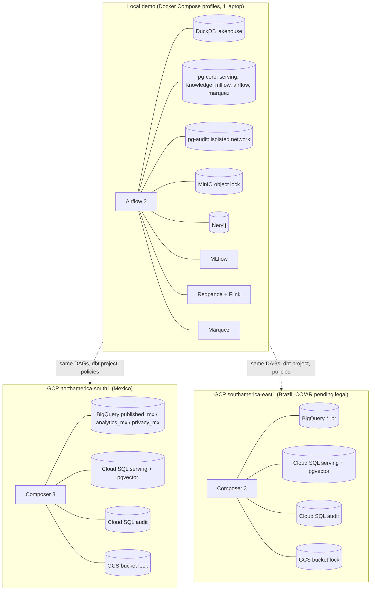
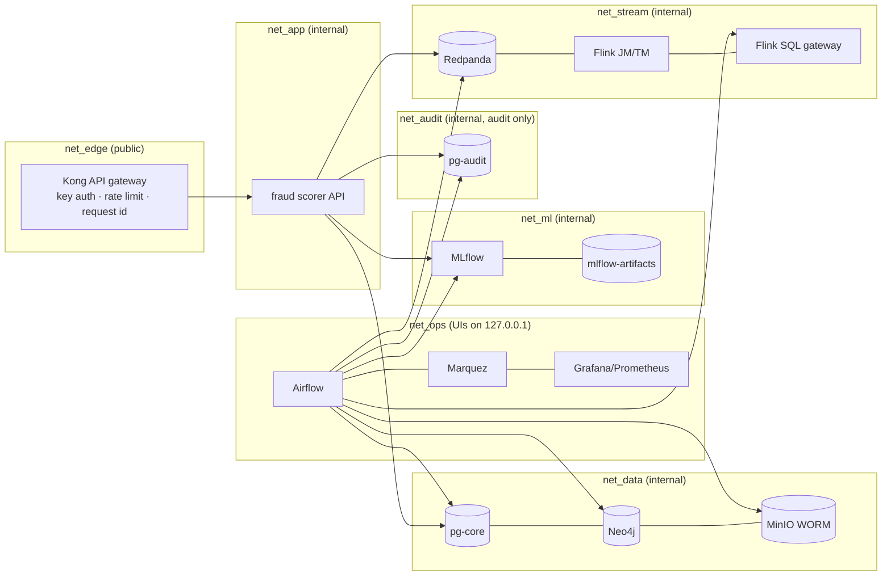

# 01 · Architecture: lakehouse with medallion zones and a Kimball core

[index](README.md) · next: [02 data flows →](02_data_flows.md)

## 1.1 What the architecture is called, and why
**A lakehouse organised in medallion zones, with a Kimball dimensional core in gold and consumer-specific
marts on top.** The medallion zones (bronze, silver, gold) describe *trust and processing level*. Kimball
(dimensions, facts, SCD2) describes *how gold is modelled*. "Marts" are the consumer-facing denormalized
tables built on the dimensional core. dbt's own layer names (staging, intermediate, marts) map onto the zones:

| zone | contents | dbt | store (local) | store (GCP) | data class |
|---|---|---|---|---|---|
| landing | files exactly as received, SHA-256 manifest | — | `data/raw` | GCS (bucket lock) | restricted PII |
| **bronze_raw** (bronze of record) | every landed record, every field as its original text; each file proven byte-exact against the landing SHA-256 and re-verified from storage | sources `bronze_raw`, `holdout_raw` | `data/lake/bronze_raw`, `holdout_raw` + MinIO WORM partitions and proofs | GCS (bucket lock) | restricted PII |
| quarantine | the untrusted backup folder, lossless | source `quarantine_raw` | `data/lake/quarantine/backup_20260831_raw` | GCS (restricted) | restricted PII |
| archive | the retired typed bronze (read-only, not deleted) | — | `data/lake/archive/bronze_typed_v1` | — | restricted PII |
| **silver** | `typed_` (lossless bronze typed against the reviewed source contracts, every record kept, breaches in `_dq_issues`), schema-drift circuit breaker (`dq_partition_*`, `dq_schema_drift`), cleansed and conformed (`stg_`, `int_`), PII tokenised for downstream | `models/silver` | DuckDB `silver` (+ `audit` for the breaker) | BigQuery / Spark | restricted → confidential |
| **gold** | Kimball core (`dim_` SCD2, `fct_`) + marts (`mart_`) | `models/gold` | DuckDB `gold` | BigQuery `published_<cc>` | confidential |
| features | point-in-time ML features and splits (`feat_`, `ml_`) | `models/features` | DuckDB + Parquet | BigQuery / feature store | confidential |
| graph | GNN/TGN/federated exports (`graph_`, `tgn_`, `fgl_`) | `models/graph` | Parquet → Neo4j | Neo4j (in region) | confidential |
| knowledge | entity documents for GraphRAG | `models/knowledge` | Parquet → pgvector/Neo4j | Cloud SQL + Neo4j | internal |
| privacy | contribution-bounded inputs; DP releases | `models/privacy` + OpenDP | DuckDB + Parquet | BigQuery `privacy_<cc>` | confidential → public |
| serving | contracts published to Postgres | `models/serving` | Postgres `bank_serving` | Cloud SQL | confidential |
| audit | DQ findings, manifests, reconciliation, SCD change log | `models/audit` | DuckDB `audit` | BigQuery + WORM | confidential |

Batch and stream share feature definitions: one dbt macro (`fraud_features`) is the reference, the Flink job
implements the same windows, and a parity check proves they agree (Kappa-style stream with batch reprocessing).

## 1.2 System context

## 1.3 Orchestration: Airflow 3 + Cosmos
* **Airflow 3.1** (Composer 3 in GCP) with **asset-based scheduling**: `landing_ingest` emits the landing
  asset → `bronze_build` → `dbt_lakehouse` → (`publish_serving`, `graph_load`, `compliance_triggers`,
  `monitoring_drift`, `ml_fraud_ensemble`) → `graph` → (`ml_tgn`, `ml_federated_gnn`). See [02](02_data_flows.md).
* **Cosmos** renders each dbt layer as a task group (one task per model, tests per group), so failures,
  retries and lineage are per model, and OpenLineage events flow to Marquez.
* **Human-in-the-loop** (`ApprovalOperator`) gates model promotion; nothing reaches `@champion` without it.
* **Isolation:** Airflow, dbt and the platform/ML code run in three separate Python environments inside the
  image, so dependency upgrades of one cannot break the others.
* Every DAG writes start/finish/failure events to the hash-chained audit ledger.

Why Airflow over Dagster or Prefect for this bank: managed offering in the target cloud (Composer), mature
OpenLineage provider, native HITL in 3.1, and the operational familiarity regulators and auditors already have.

## 1.4 Local, cloud or hybrid
**Hybrid by data class.** Experimentation and demos run fully local (DuckDB + Docker). Production runs in GCP
per residency region. Only tokenised gold/serving/privacy outputs are published to BigQuery for analytics;
raw PII never leaves its in-country (or legally approved) region.

| option | verdict |
|---|---|
| Everything local (DuckDB, Docker) | right for development, CI and demos on synthetic data; not for production PII |
| Everything in one cloud region | violates residency for at least one country; single region is a concentration risk |
| **Hybrid by data class (recommended)** | lakehouse + serving + audit per residency region; BigQuery analytics layer per region; DP aggregates are the only cross-border analytics |
| "Some marts in BigQuery" only | sound as the analytics layer (implemented: `models/bigquery`, targets `bq_mx`/`bq_br`); the serving and audit stores still need their own in-region homes |

## 1.5 Storage compartments and network segmentation
Each store has one purpose, its own credentials and its own network. In GCP these become separate projects or
instances inside a VPC Service Controls perimeter (Terraform: `platform/infra/terraform/gcp`).

| store | holds | writer roles | reader roles | immutability |
|---|---|---|---|---|
| landing (`data/raw`) | files as received | ingestion only | bronze build | SHA-256 manifest in WORM |
| bronze_raw (`data/lake/bronze_raw`) | original-text records, proof manifests | bronze build | dbt (silver `typed_` models), auditors | append-only by record-digest check; partitions and proofs in WORM; `bronze-raw-verify` rebuilds every file |
| archive (`data/lake/archive/bronze_typed_v1`) | the retired typed bronze | `archive-typed-bronze` (once) | auditors | read-only files and directories; moved, never copied or deleted; per-zone SHA-256 in `ARCHIVE_*.json` and the ledger |
| MinIO `bronze-worm`, `audit-anchors` | manifests, chain anchors | `latam-platform` user (put only) | auditors | **object lock COMPLIANCE** |
| pg-core `bank_serving` | serving tables, online features, decisions | `publisher`, `scorer` (decisions append-only) | `app_reader` | decision log append-only (triggers) |
| pg-core `knowledge` | KB registry, chunks (pgvector) | `publisher` | `app_reader` reads **only** `kb.active_chunk` | registry/events append-only |
| **pg-audit** `audit` | ledger, GenAI audit, triggers, DP budget, DSAR, keys | `audit_writer` (INSERT only) | `audit_reader` | hash chains + no UPDATE/DELETE/TRUNCATE + WORM anchors |
| pg-core `mlflow` + MinIO artifacts | runs, registry, models | MLflow server | MLflow server | registry versions immutable; aliases audited |
| pg-core `marquez` | OpenLineage events | Marquez | Marquez | append-only event log |
| Neo4j | entity graph (tokens), KB graph | Airflow | agents (pending) | rebuilt from lakehouse/KB (derived) |
