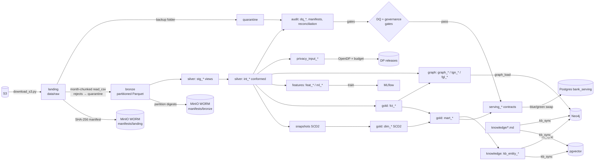
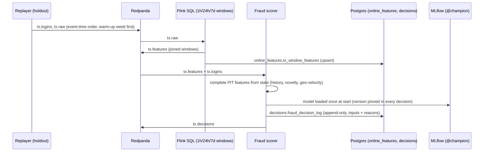
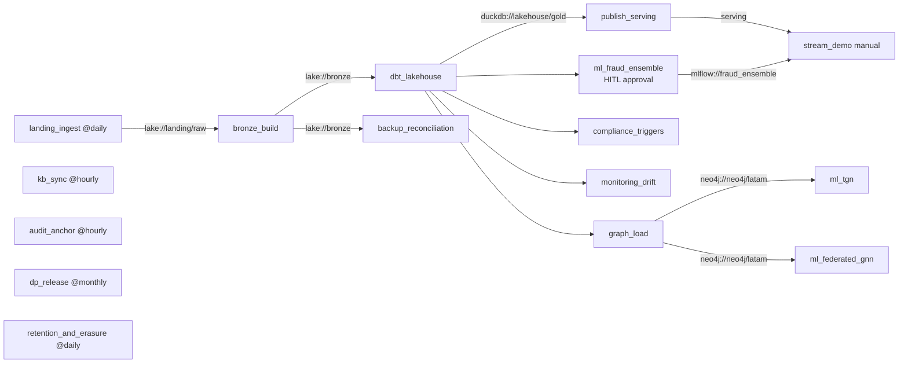
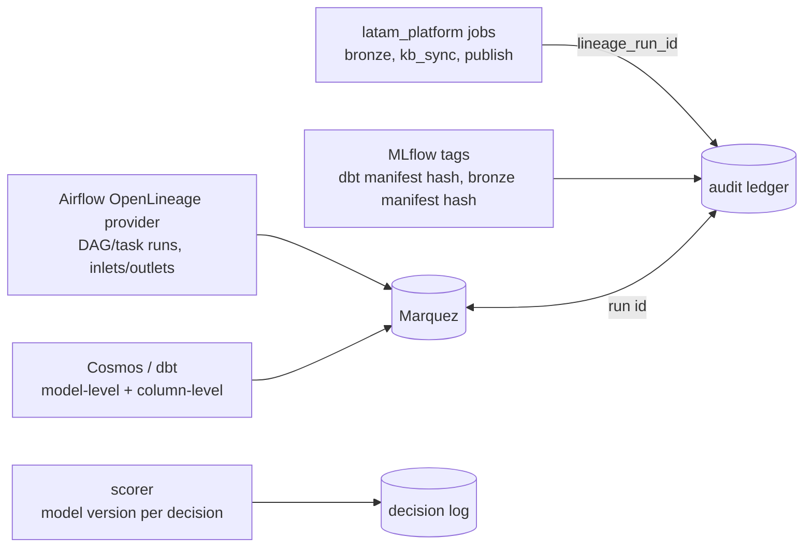

# 02 · Data flows: batch, stream, assets and lineage

[← 01 architecture](01_architecture.md) · [index](README.md) · next: [03 data split →](03_data_split.md)

## 2.1 Batch flow (landing → serving)

Gates that stop the flow: landing modified/deleted file (incident), bronze not reconciling or rewriting a
partition, severity-A data-quality SLO breach, governance check failure (missing owner/class/residency,
restricted column outside silver, serving without contract), restricted column at publish time, detector CI
failure, model-risk rejection, stream/batch parity mismatch, broken audit chain.

## 2.2 Streaming flow (real-time fraud) with latency budget

| hop | budget (p95) | evidence |
|---|---|---|
| broker + Flink windows | < 1 s at demo rates | Flink metrics (Prometheus :9249) |
| scorer feature completion + model | < 50 ms | `fraud_scoring_latency_seconds` |
| decision persisted | batched every 200 rows / 1 s | decision log `decided_at` |

## 2.3 Asset graph (data-aware scheduling)

## 2.4 Lineage: who emits what

Every artefact carries a `lineage_run_id` (the Airflow run id): bronze rows (`_ingest_run_id`), publication
log rows, KB versions and snapshots, MLflow runs, ledger events. Joining on it answers "which data, code and
model produced this decision", end to end.

The generated dbt lineage (zone and model level) is in [generated/dbt_lineage.md](generated/dbt_lineage.md).
