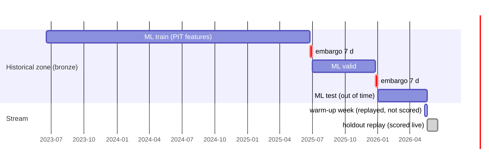

# 03 · Data split for the demo: historical, stream holdout, ML splits

[← 02 data flows](02_data_flows.md) · [index](README.md) · next: [04 audit and lineage →](04_audit_and_lineage.md)

One boundary, defined once (`latam_platform.config.STREAM_CUTOFF` = dbt var `stream_cutoff` = 2026-05-18):

| set | rows (transactions) | where | used by |
|---|---:|---|---|
| historical | 4,294,318 | `data/lake/bronze` | all batch marts, training, graph, KB |
| holdout | 130,690 | `data/lake/holdout` | stream replay; `feat_fraud_stream_parity` |
| ML train / valid / test | split column in `feat_fraud_realtime_pit` | `features.ml_fraud_*` | fraud ensemble, Kumo probes |
| graph silos | MX / CO / AR customers | `graph.fgl_silo_*` | federated GNN |
| TGN stream | customer→merchant events | `graph.tgn_tx_events` | temporal GNN |

Rules:
* **Embargo:** rows within 7 days before each boundary (`split = 'embargo'`) are excluded from every set, so
  no 7-day feature window straddles train/valid or valid/test.
* **Warm-up:** the replayer sends the last 7 historical days first (`is_warmup = true`) so Flink's windows
  hold the same history as batch; the scorer skips them because its state was bootstrapped from batch.
* **Batch "now":** `as_of_date = 2026-05-17` (end of the historical zone); Airflow can override it per run.
* All other facts (contacts, complaints, sends, surveys) are split the same way, so batch marts never see
  information from the replayed period.
