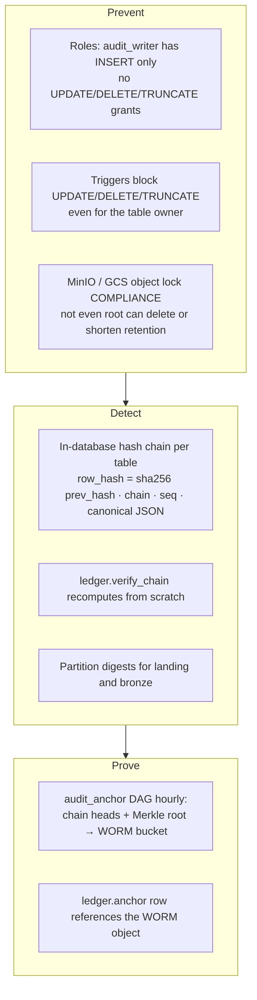

# 04 · Audit, integrity and lineage: records that cannot be changed after registration

[← 03 data split](03_data_split.md) · [index](README.md) · next: [05 privacy and compliance →](05_privacy_and_compliance.md)

## 4.1 Three layers of tamper evidence



Verified on the running stack (see [runbook](runbook.md)):

| attack | result |
|---|---|
| `UPDATE` / `DELETE` / `TRUNCATE` on `ledger.event` as `audit_writer` | `permission denied` |
| same as table owner (`audit_owner`) | trigger raises `append-only` |
| superuser disables triggers and edits a payload | `verify_chain` → `content hash mismatch (row edited)` |
| delete or shorten retention of an anchor object as MinIO root | `WORM protected and cannot be overwritten` |
| modify or delete a landing file | `landing_ingest` raises an integrity incident and records it |
| rebuild a bronze partition with different content | `BronzeIntegrityError` (append-only by digest) |

The hash is computed **by the database** in a `SECURITY DEFINER` trigger with an advisory lock, so a client
can neither choose its own hash nor race the chain. Canonicalisation pins `timezone = UTC` so verification
does not depend on session settings.

## 4.2 Ledger contents

| table | what is recorded |
|---|---|
| `ledger.event` | every pipeline step (landing manifest, bronze table built/sealed, DQ and governance gates, publication, KB sync, model registered/promoted, DP release, erasure, Airflow DAG run success/failure) |
| `ledger.anchor` | each WORM anchoring with heads, Merkle root, verification result |
| `genai.*` | model versions, prompt versions (full system instructions), requests, retrievals (doc, version, chunk hash, score, KB snapshot), generations (redacted I/O, output hash, guardrail verdicts, tool calls), human overrides, feedback |
| `compliance.trigger_event` | every regulatory trigger firing with evidence, deadline and action |
| `privacy.budget_ledger` | every DP release request, approved or refused, with epsilon/delta |
| `dsar.request` | data-subject requests and their legal basis / legal hold |
| `keys.subject_key` | per-subject data keys (the only mutable column: shredding) |

## 4.3 GenAI audit: every layer of an LLM interaction

```mermaid
sequenceDiagram
  participant A as Agent (pending module)
  participant G as genai_audit.AuditedLLM
  participant P as pii_guard
  participant R as Retrieval (kb.active_chunk / Neo4j / SQL tools)
  participant L as LLM (versioned)
  participant D as pg-audit genai.*
  participant M as MLflow Tracing
  A->>G: call(user_input, purpose, retrieved, subject_token)
  G->>P: redact input
  G->>D: genai.request (caller, purpose, country, token)
  G->>D: genai.retrieval per item (doc_id@version, chunk sha256, score, KB snapshot)
  G->>L: system instructions (prompt_version) + context
  L-->>G: output
  G->>P: redact output; guards (numbers grounded, PII)
  G->>D: genai.generation (model_version, prompt_version, params, redacted I/O, output sha256, verdicts)
  G->>M: span tree, trace_id stored on the request
  Note over A,D: a reviewer's approve/edit/reject goes to genai.human_override
```

An answer whose numbers do not appear in retrieved/tool content is **blocked** (tested). The exact output is
kept only as a SHA-256, so a disputed answer can be proven without storing personal data.

## 4.4 Erasure without breaking immutability: crypto-shredding
Personal fields inside immutable records are encrypted with a per-subject AES-256-GCM key wrapped by a master
key (KMS/HSM in production). An approved erasure request destroys the subject key: the payload becomes
unreadable, the hash chains stay valid, and the destruction itself is a ledger event. Derived operational
stores (serving tables, online features, Neo4j) are purged; legal holds (AML, transaction ledgers) block erasure
and are logged (`retention_and_erasure` DAG).

## 4.5 Lineage
OpenLineage events from Airflow and Cosmos/dbt flow to Marquez (UI on `127.0.0.1:3000`); platform jobs write
`lineage_run_id` into bronze rows, publication logs, KB versions, MLflow tags and ledger events. In GCP the same
events go to Dataplex lineage. See [02 §2.4](02_data_flows.md#24-lineage-who-emits-what).
