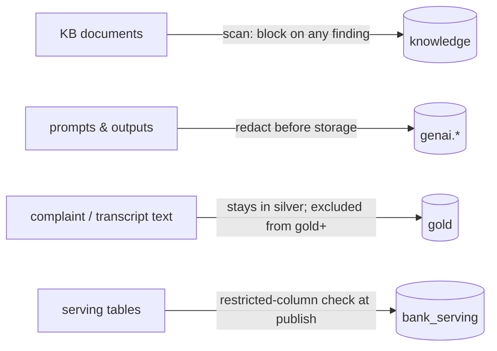
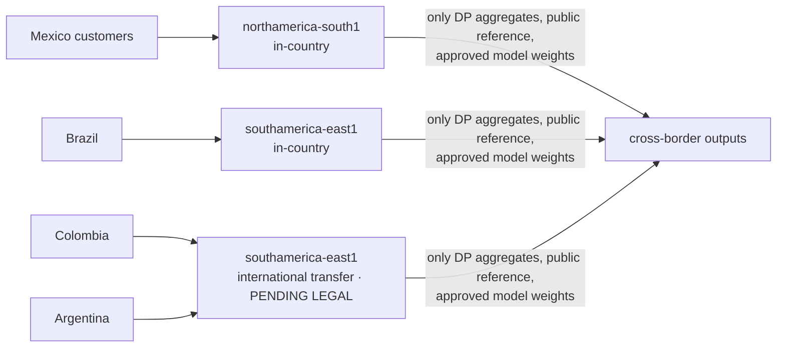

# 05 · Privacy, residency and regulatory triggers in the pipelines

[← 04 audit and lineage](04_audit_and_lineage.md) · [index](README.md) · next: [06 knowledge and GraphRAG →](06_knowledge_and_graphrag.md)

> Not legal advice. Policy parameters (regions for CO/AR, retention periods, deadlines) are placeholders to be
> confirmed by counsel; they live in `platform/policies/*.yaml` so a legal decision is a reviewed config change.

## 5.1 Policies as code
| file | enforced by |
|---|---|
| `data_classification.yaml` | dbt tests `assert_no_restricted_pii_outside_silver`, `assert_protected_attributes_isolated`; `governance-check` on the manifest; publish-time column check |
| `residency.yaml` | dbt `meta.residency`; `dim_country.residency_region`; federated silos; Terraform org policy `gcp.resourceLocations` per environment |
| `retention.yaml` | WORM retention in MinIO/GCS; `retention_and_erasure` DAG |
| `regulatory_triggers.yaml` | `compliance_triggers` DAG, `kb_sync`, `monitoring_drift`, scorer decision log |
| `kb_governance.yaml` | `kb_pipeline` (status gate, effective window, PII block, reconciliation) |

## 5.2 PII guardrails: four choke points

`latam_platform.pii_guard` recognises e-mail, phone, IP, card PAN (Luhn), CURP, RFC, CLABE (check digit),
CPF and CNPJ (check digits), CUIT (check digit), Colombian NIT, labelled CC/DNI/cédula numbers and Pix EVP keys;
check digits keep false positives low on numeric banking text. Presidio NER adds person names where installed.
In GCP the equivalent DLP inspect template is in Terraform (`modules/dlp`).

Two real leaks were caught by these tests while building the platform and fixed: raw IP addresses in the graph
export (now tokenised) and the customer's detected accent (a proxy attribute) in a gold fact.

## 5.3 Residency

BigQuery has regional locations in Querétaro (`northamerica-south1`) and São Paulo (`southamerica-east1`) and
none in Colombia or Argentina (checked against the BigQuery locations page in Oct 2026). Federated graph learning
keeps each country's customer subgraph in its own silo; only model updates move (§07).

## 5.4 Differential privacy: where it fits and where it does not

| use | DP? | why |
|---|---|---|
| cross-country / external statistics, regulator dashboards with aggregates, third-party analytics | **yes** | releases leave the trust boundary; DP bounds what any single customer contributes |
| synthetic data for development | yes (DP synthesizers) | dev data must not memorise real customers |
| training on sensitive attributes | evaluate DP-SGD (Opacus) per model | utility cost is real; decide per model with model risk |
| federated updates | DP-FedAvg (clip + Gaussian noise) implemented | protects silos from update inversion |
| fraud / AML / credit decisions | **no** | decisions need exact data about the person |
| statutory regulatory reports | **no** | regulators require exact figures |

Implementation (`latam_platform.privacy`, `dp_release` DAG): group keys from public domains only; contribution
bounding in dbt (`privacy_input_*`) and per-unit group limits in Python; OpenDP discrete Laplace with epsilon read
from OpenDP's privacy map; **budget debited in the immutable ledger before release** and refused when exhausted
(tested); small noisy cells suppressed as post-processing. In BigQuery the same release is a view using
`SELECT WITH DIFFERENTIAL_PRIVACY` with a DP analysis rule budget (`models/bigquery/bq_dp_complaints_country_month`).

## 5.5 Regulatory triggers

| trigger | evaluated by | action |
|---|---|---|
| consent_revoked | compliance_triggers (sends without current consent, last 7 days) | suppress and record |
| data_subject_erasure | retention_and_erasure | crypto-shred + purge serving, online state, Neo4j |
| complaint_sla_at_risk | compliance_triggers (open disputes at 80 % of SLA) | alert owner |
| aml_typology_hit | compliance_triggers (customer-month typologies) | open case |
| fraud_block_decision | scorer (decision log with inputs and reasons) | record decision |
| pii_outside_pii_zone | dbt governance tests, publish check | block publish, incident |
| residency_violation | governance check, Terraform org policy | block |
| model_drift_or_fairness_breach | monitoring_drift (PSI > 0.25, disparate-impact ratio < 0.8) | model-risk review |
| kb_document_expired | kb_sync (pruned versions) | prune from active index |
| retention_expired | retention policy + WORM expiry | archive or delete |
