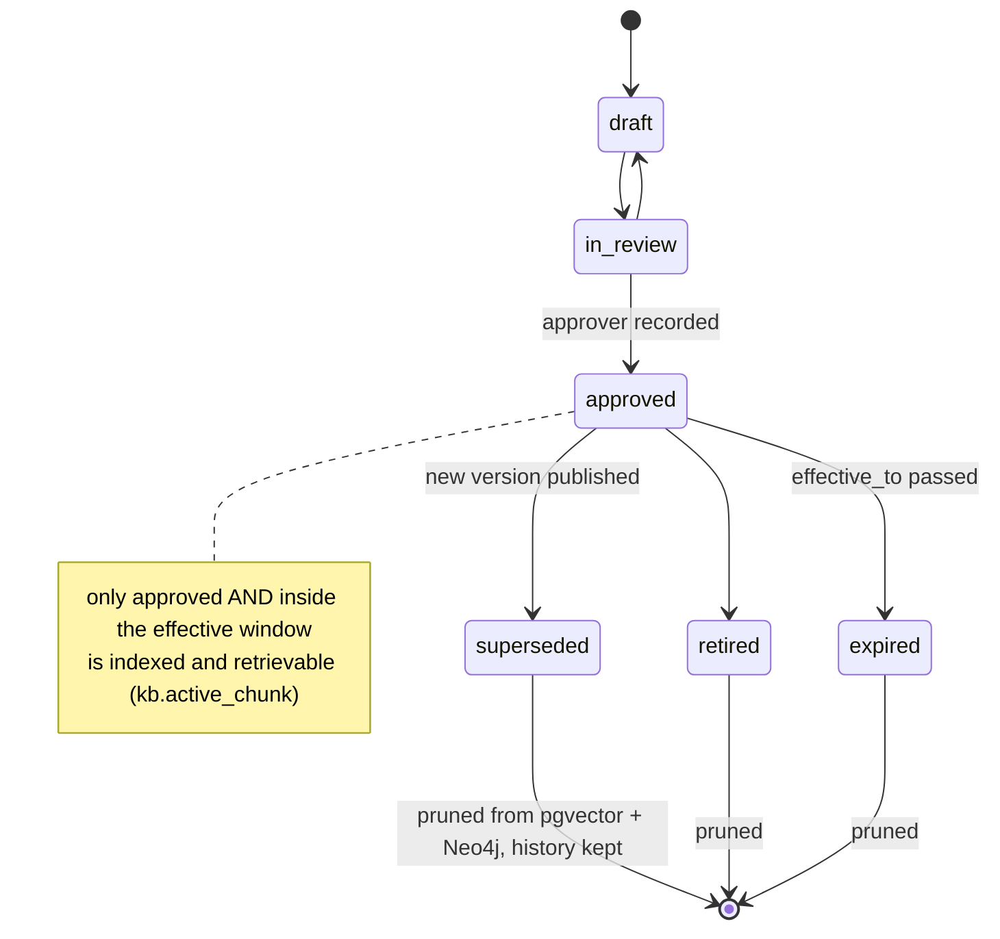
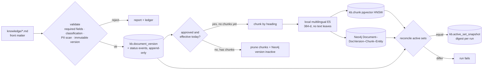
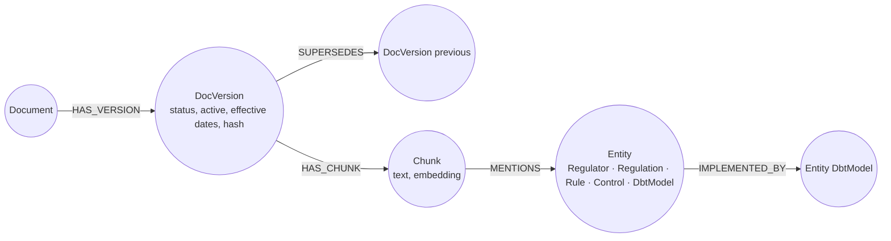

# 06 · Knowledge base and GraphRAG: no draft or outdated guidance, ever

[← 05 privacy and compliance](05_privacy_and_compliance.md) · [index](README.md) · next: [07 ML and graph learning →](07_ml_and_graph_learning.md)

## 6.1 Document lifecycle

## 6.2 Sync pipeline (`kb_sync`, hourly)

Guarantees (tested in `platform/libs/tests/test_kb_pipeline.py`):
* superseded, draft, retired and expired versions are never in `kb.active_chunk`, the only relation retrieval
  may read (`app_reader` has no access to the base tables);
* a new version prunes the previous one from pgvector and Neo4j while the registry keeps both and the status
  history (`approved → superseded`) as events;
* editing an existing version without bumping it is rejected (versions are content-hashed);
* a document containing personal data is rejected before anything is stored;
* each run snapshots a digest of the active set, so "what did the assistant know on date T" is answerable and
  every GenAI retrieval row references the snapshot id.

## 6.3 Graph model in Neo4j

Entities are extracted deterministically (regulators, regulations, data-quality rules R01–R27, controls C1–C10,
dbt model names from the manifest), so the graph contains no LLM-invented facts. Controls link to the dbt models
that implement them, letting a compliance question traverse regulation → control → model → test. Chunks carry
embeddings with a Neo4j vector index (`chunk_embedding`) for hybrid vector + graph retrieval.

The entity graph from the lakehouse (`graph_load`: customers as tokens, products, merchants, branches, agents,
campaigns, complaints, shared IPs as tokens) lives in the same database under separate labels; customer-level
documents are not placed in the knowledge base (they are confidential, the KB allows public/internal only).
