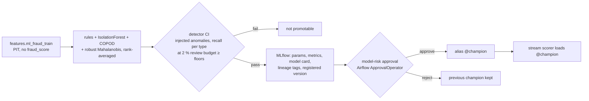
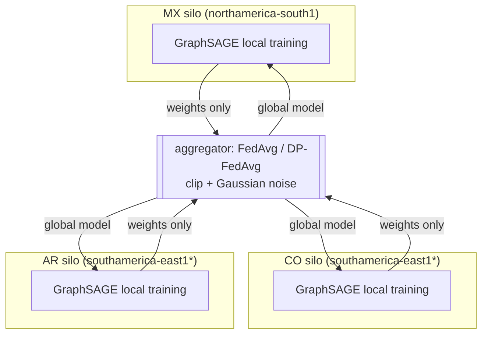

# 07 · ML, DL and graph learning pipelines (MLflow)

[← 06 knowledge and GraphRAG](06_knowledge_and_graphrag.md) · [index](README.md) · next: [08 agentic interfaces →](08_agentic_interfaces.md)

## 7.1 Fraud ensemble with detector CI and human approval

Measured on the lakehouse (sample of 150k training rows, out-of-time test):

| check | result |
|---|---|
| detector CI recall at 2 % budget: amount spike, velocity burst, geo-impossible, dormant reactivation, foreign night burst | 1.00 each (floors 0.5–0.8) |
| AUC against `is_fraud` (out of time) | 0.48, base rate 0.08 % |
| decisions on test | 99.0 % approve, 1.0 % step-up, 0.01 % decline |

The label result is the expected and honest one: `is_fraud` encodes the legacy score, so no behavioural model
can learn it. The ensemble is therefore promoted on detector CI and capacity, and the model card says so.
Each decision in the stream stores the model version, inputs and reason codes (rules + most unusual features).

## 7.2 Temporal graph network (TGN)
Self-supervised future-link prediction on `graph.tgn_tx_events` (customer→merchant, time-ordered,
out-of-time split; fraud labels unused). Smoke test on 60k train / 15k test events: link AP 0.50, AUC 0.50.
With 24 merchants chosen uniformly by the generator, "which merchant next" carries no signal, so the honest
result is chance level. The pipeline (memory, temporal neighbour sampling, MLflow logging) is ready for real
counterparty data, where TGN embeddings are the strongest known features for mule and ATO detection.

## 7.3 Federated graph learning across residency silos

Task: complaint in the next 90 days (PIT cutoff), 3.6 % positives; silos from `graph.fgl_silo_nodes/edges`
(merchants are public nodes replicated per silo). Smoke test (5 rounds): local-only AUC 0.49/0.49/0.50,
federated 0.51/0.50/0.49, centralised 0.48/0.50/0.51 (AR/CO/MX). All at chance: complaint behaviour is not
encoded in the synthetic graph. The value delivered is the mechanism, which is measured against the
centralised baseline on every run so the cost of federation is known when real data arrives. Production: Flower
with secure aggregation; DP-FedAvg parameters tuned with model risk.

## 7.4 What MLflow records (ML and GenAI)
| run type | params | metrics | tags / artefacts |
|---|---|---|---|
| fraud_ensemble | detectors, seed, budget | label AUC/AP, decision rates, detector CI recall per type | dbt manifest SHA-256, bronze manifests SHA-256, training query, Airflow run id, model card JSON, registered version |
| tgn_link_prediction | events, epochs, dims | link AP/AUC, loss curve | input path, labels used = none |
| federated_gnn_complaint90d | variant, rounds, DP clip/noise | AUC per silo for local/federated/centralised | residency statement |
| GenAI (pending agents) | — | latency, tokens, guardrail outcomes | MLflow Tracing span tree; trace id joins `genai.request` in the audit store |
