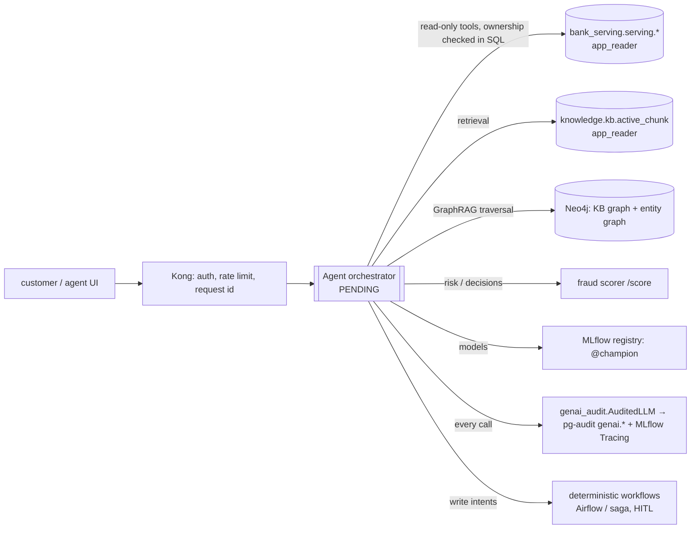

# 08 · Agentic module (pending): the interfaces it will use

[← 07 ML and graph learning](07_ml_and_graph_learning.md) · [index](README.md) · next: [ADRs →](adr/README.md)

The agentic module is not built yet. The platform already provides everything it consumes, behind
least-privilege interfaces, and the audit trail it must write to.

| interface | contract | guarantees already in place |
|---|---|---|
| `serving.customer_360`, `account_inquiry`, `card_support`, `dispute_case`, `credit_eligibility` | dbt contracts (typed, enforced), published with digest + run id | tokens only; restricted columns blocked at publish; read via `app_reader` |
| `kb.active_chunk` | approved, effective, PII-free chunks with doc version | drafts/outdated never visible; snapshot id per sync |
| Neo4j | `Document/DocVersion/Chunk/Entity` + entity graph labels | active versions only; deterministic entities |
| `POST /fraud/score` via Kong | feature vector → decision, reasons, model version | key auth, rate limit, request id |
| `genai_audit.AuditedLLM.call(...)` | model + prompt versions, retrieval list, purpose, subject token | redaction, numbers-grounded guard, hash-chained records, override API |
| regulatory triggers | `compliance.trigger_event` | the agent reads open triggers (e.g. SLA at risk) as tasks |

Rules the agent design must keep (from docs/strategy/08): read tools are narrow and parameterised; write
actions are intents executed by deterministic workflows with policy checks and HITL; decisions never come from
the LLM; every tool call is audited.
