# Data model · the gold star schemas

[index](README.md) · [02 data flows](02_data_flows.md) · [ADR-017 aggregates](adr/ADR-017.md)

Gold has two layers that serve different readers:
- **The core** (`platform/dbt/models/gold/core`) is a Kimball constellation: five facts at their natural grain sharing
  eight dimensions. Customer and product are SCD Type 2 and are joined point-in-time.
- **The marts** (`platform/dbt/models/gold/marts`) are one table per product decision, each built from the core and
  keyed back to it.

Every diagram puts the fact or mart in the centre and its dimensions around it, as in the literature.

| Colour | Meaning |
|---|---|
| 🟨 amber | fact table |
| 🟦 blue | dimension used by one fact |
| ⬜ grey | **conformed** dimension, shared by two or more facts (same keys, same meaning everywhere) |
| 🟪 violet | use-case mart |
| red dashed line | a key that exists but must not be used for joins (rule R25) |

Columns, row counts and relationships come from the built lakehouse, so the pictures follow the models. Row counts
are for the history zone; the last month (from 2026-05-18) is held out for the stream ([03 data split](03_data_split.md)).
To regenerate after a build, run:

```bash
cd platform && uv run python dbt/scripts/star_schemas.py    # writes docs/assets/star-schemas/*.svg
```

## The bus matrix

Which dimensions each fact uses. A dimension in two or more rows is conformed.

| Fact | customer | product | date | country | branch | agent | campaign | merchant |
|---|:-:|:-:|:-:|:-:|:-:|:-:|:-:|:-:|
| `fct_transaction` | ✓ | ✓ | ✓ | ✓ | ✓ | | | ✓ |
| `fct_complaint` | ✓ | ✗ R25 | ✓ | | ✓ | ✓ | | |
| `fct_interaction` | ✓ | | ✓ | | | ✓ | | |
| `fct_campaign_send` | ✓ | | ✓ | | | | ✓ | |
| `fct_digital_session` | ✓ | | ✓ | ✓ | | | | |

`fct_complaint.origin_interaction_id` also links complaints to the contact that raised them (a drill-across between
two facts).

## The core constellation


## Core stars

### `fct_transaction`
The payment and card events behind every mart. `fraud_score` is a leaked label and never a feature (ADR-012).

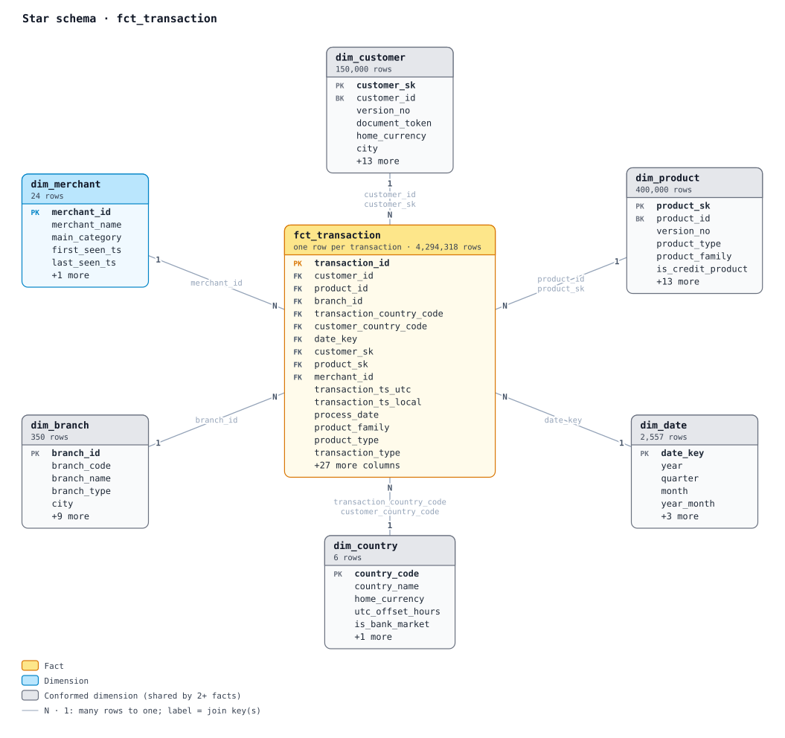

### `fct_complaint`
Complaint cases with SLA clocks. `affected_product_id` points to another customer's product in every non-null case, so
it is drawn as a forbidden join.

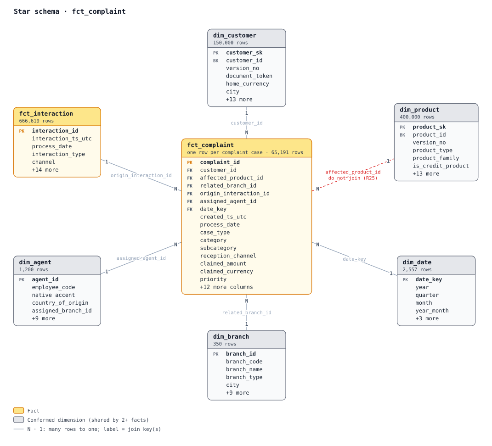

### `fct_interaction`
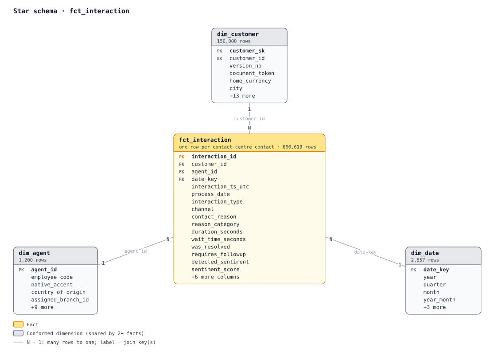

### `fct_campaign_send`
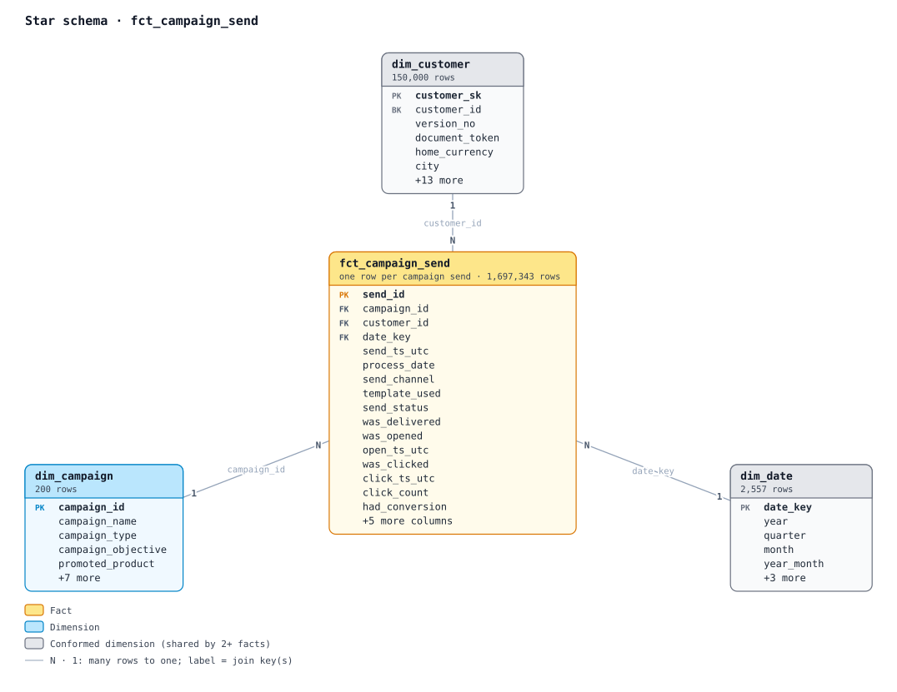

### `fct_digital_session`
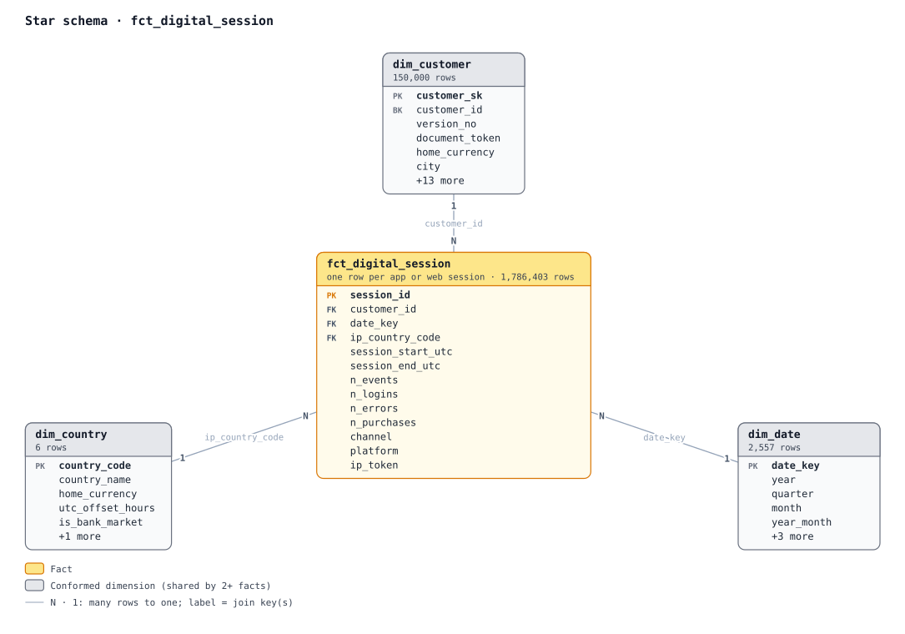

## Use-case marts

| Mart | Grain | Consumers |
|---|---|---|
| [`mart_card_support`](#mart_card_support) | one row per card | card operations, the copilot |
| [`mart_customer_360`](#mart_customer_360) | one row per customer | the copilot, CRM, credit, GraphRAG |
| [`mart_account_payment_inquiry`](#mart_account_payment_inquiry) | one row per product | contact centre, chatbot, the copilot |
| [`mart_product_recent_transactions`](#mart_product_recent_transactions) | last 20 transactions per product | inquiry answers |
| [`mart_transaction_disputes`](#mart_transaction_disputes) | one row per transaction or fee dispute | disputes, regulatory reporting, the copilot |
| [`mart_credit_eligibility`](#mart_credit_eligibility) | latest eligibility per customer | credit operations, the copilot, the customer app |
| [`mart_collections_early_warning`](#mart_collections_early_warning) | one row per loan or credit card | collections, the copilot |
| [`mart_aml_customer_month`](#mart_aml_customer_month) | one row per customer and month | AML monitoring, investigators |
| [`mart_cx_journey`](#mart_cx_journey) | one row per contact | CX analytics, QA, the escalation model |
| [`mart_campaign_compliance_uplift`](#mart_campaign_compliance_uplift) | one row per campaign send | marketing compliance, uplift models |

### mart_card_support
Decline diagnostics and a rule-based next best action per card; the copilot answers from its serving contract.


### mart_customer_360
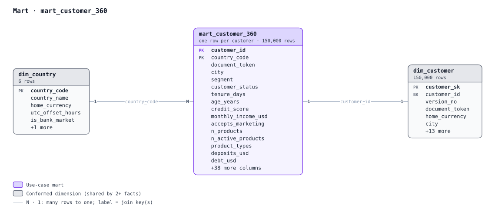

### mart_account_payment_inquiry
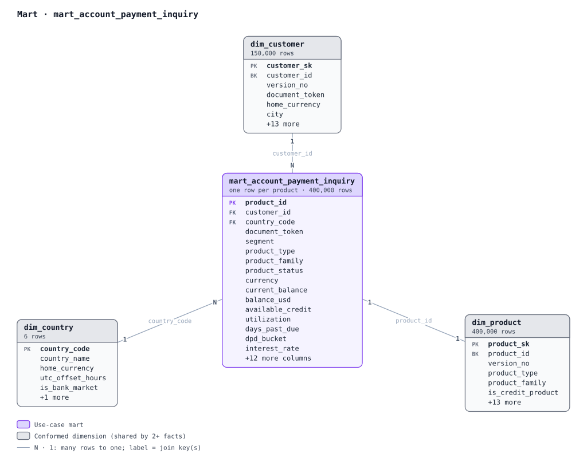

### mart_product_recent_transactions
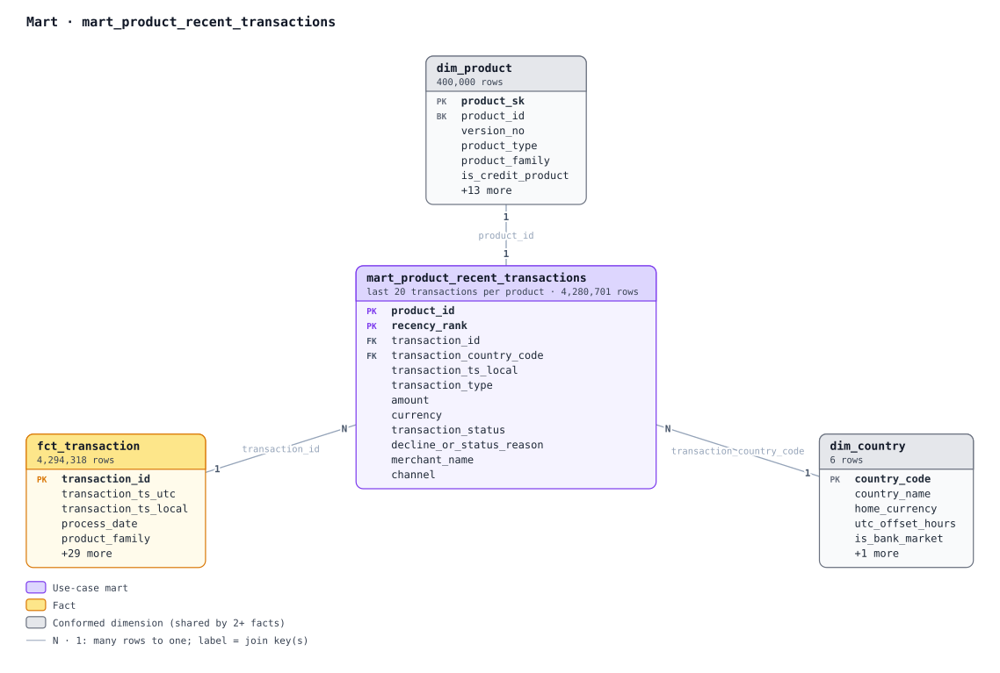

### mart_transaction_disputes
The link to the disputed transaction is probabilistic. Candidates are the customer's transactions in the 60 days
before the claim, scored by product, amount (within 1 %) and recency; the best one is kept with its confidence and
evidence.

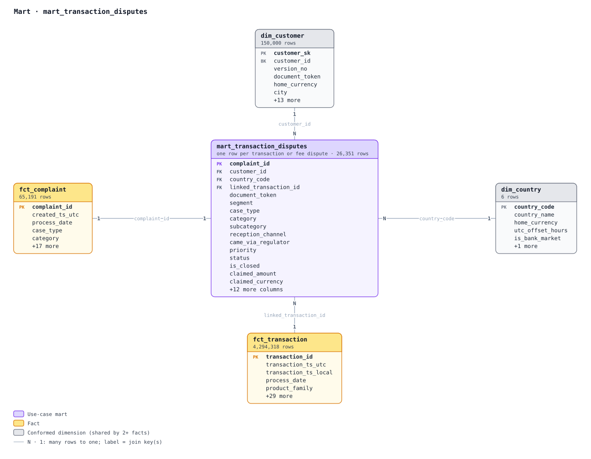

### mart_credit_eligibility
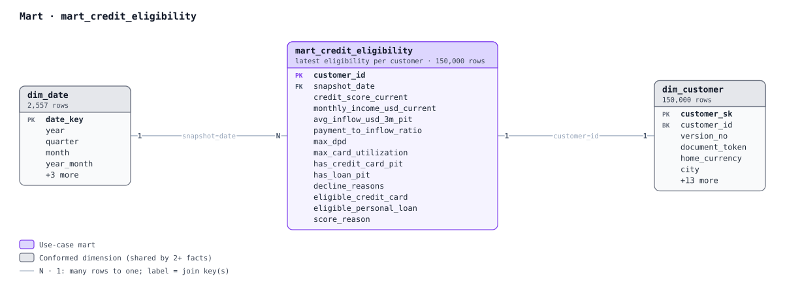

### mart_collections_early_warning
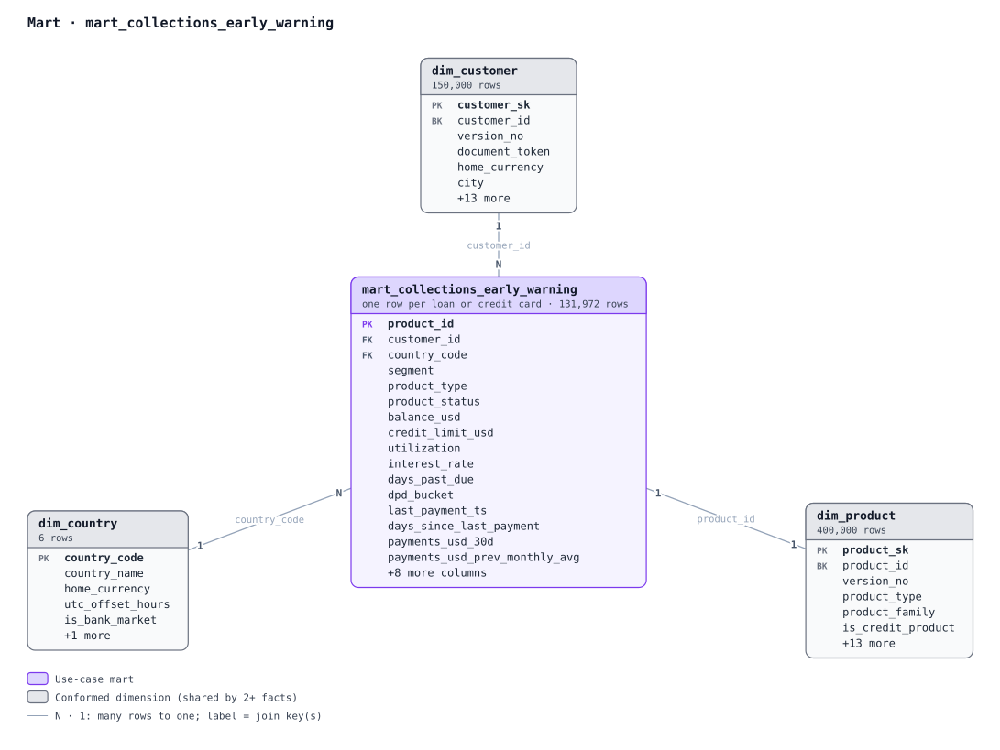

### mart_aml_customer_month
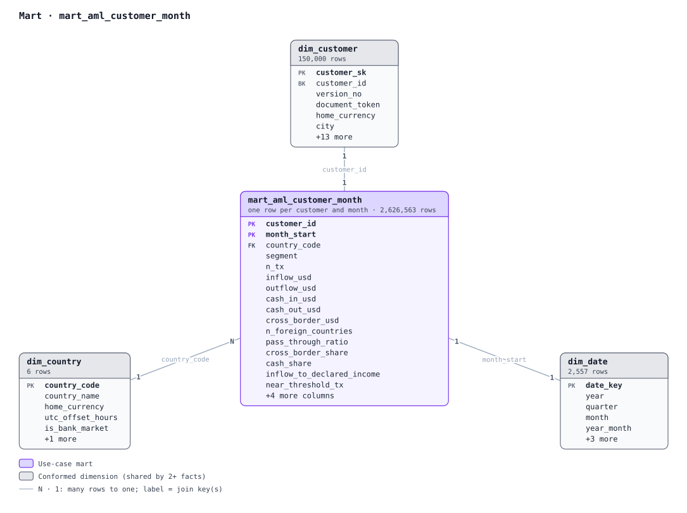

### mart_cx_journey
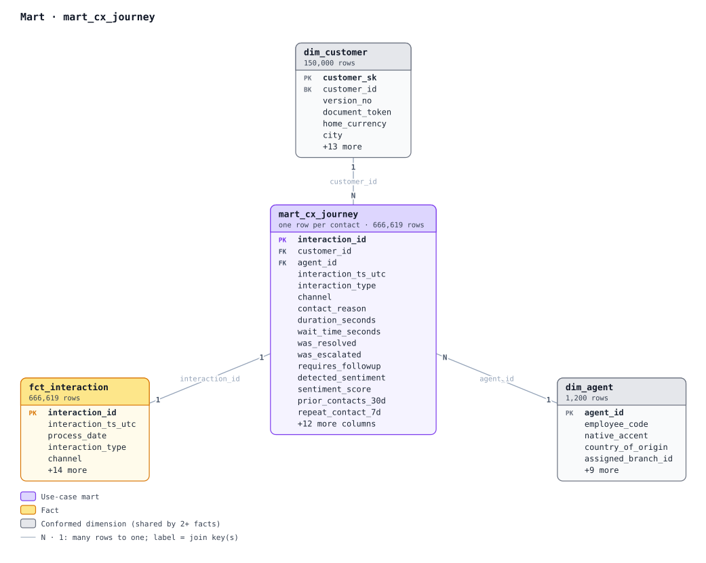

### mart_campaign_compliance_uplift
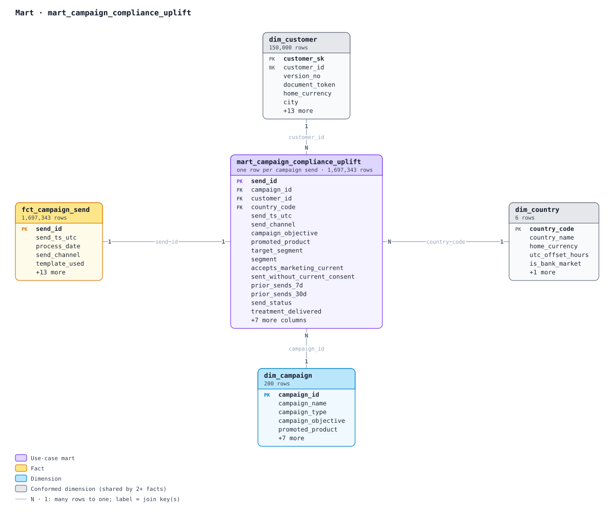
