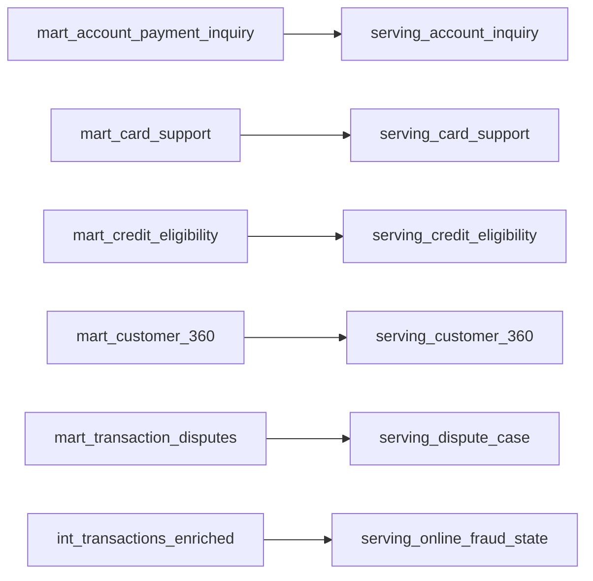
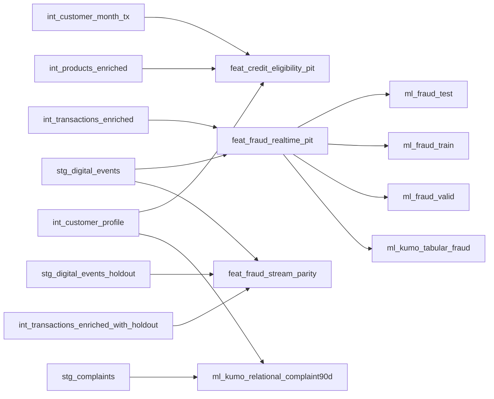
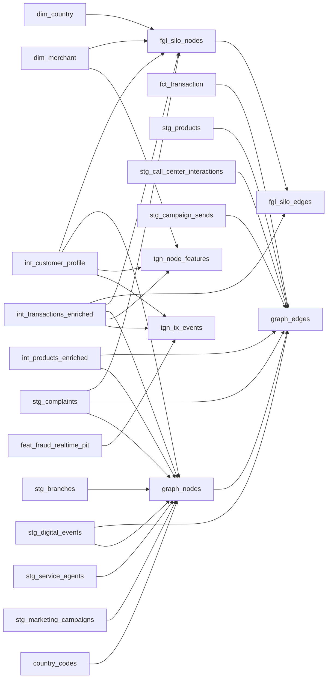
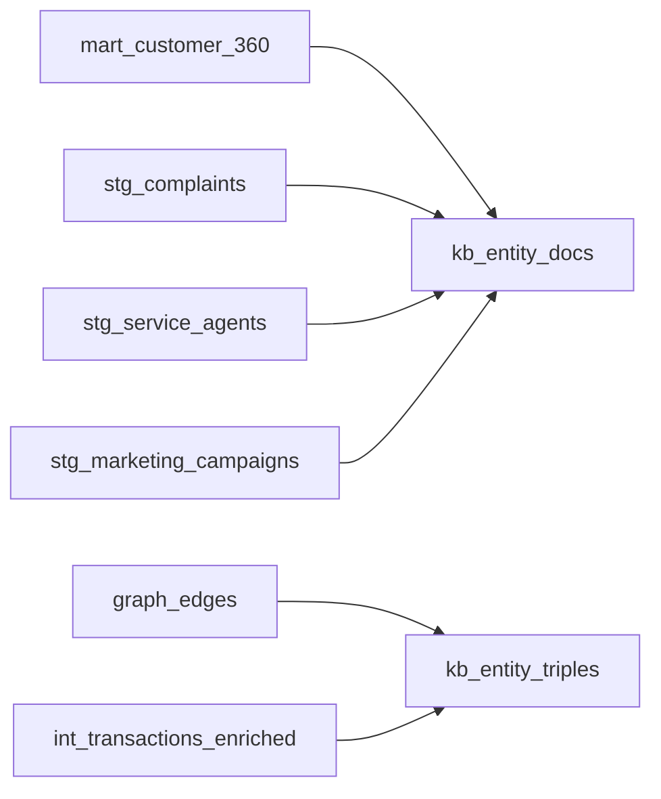
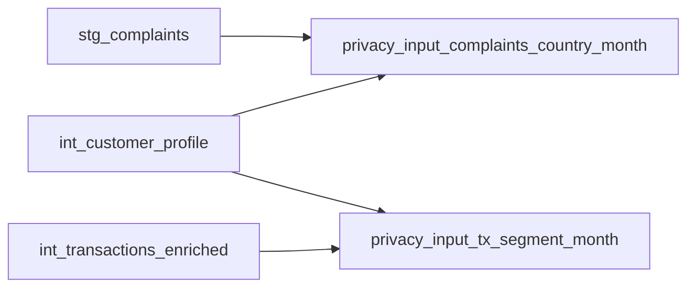

# dbt lineage (generated)

_Generated from `platform/dbt/target/manifest.json` (73 models)._

## Zone-level lineage

```mermaid
flowchart LR
  audit["audit<br/>5 nodes"]
  features["features<br/>8 nodes"]
  gold["gold<br/>22 nodes"]
  graph["graph<br/>6 nodes"]
  knowledge["knowledge<br/>2 nodes"]
  privacy["privacy<br/>2 nodes"]
  reference["reference<br/>5 nodes"]
  serving["serving<br/>6 nodes"]
  silver["silver<br/>22 nodes"]
  snapshots["snapshots<br/>4 nodes"]
  source_holdout["source:holdout<br/>2 nodes"]
  source_published["source:published<br/>4 nodes"]
  source_raw["source:raw<br/>13 nodes"]
  source_raw_backup["source:raw_backup<br/>5 nodes"]
  features -->|1| gold
  features -->|1| graph
  gold -->|4| graph
  gold -->|1| knowledge
  gold -->|5| serving
  graph -->|1| knowledge
  reference -->|1| audit
  reference -->|1| gold
  reference -->|1| graph
  reference -->|8| silver
  silver -->|21| audit
  silver -->|10| features
  silver -->|40| gold
  silver -->|22| graph
  silver -->|4| knowledge
  silver -->|4| privacy
  silver -->|1| serving
  silver -->|4| snapshots
  snapshots -->|1| audit
  snapshots -->|2| gold
  source_holdout -->|2| silver
  source_raw -->|11| audit
  source_raw -->|13| silver
  source_raw_backup -->|5| audit
```

## Model-level lineage into `serving`



## Model-level lineage into `features`



## Model-level lineage into `graph`



## Model-level lineage into `knowledge`



## Model-level lineage into `privacy`


