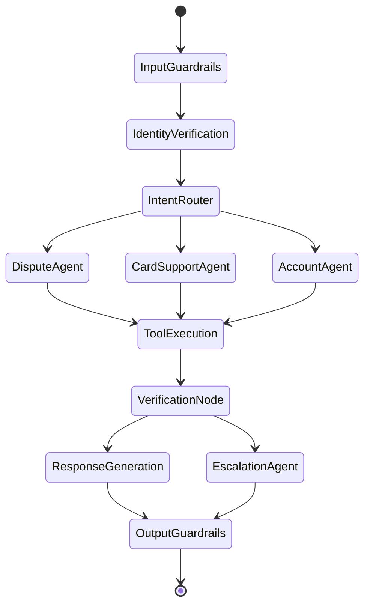

# Factored AI & Data Hackathon 2026: Multi-Agent System Specification

This document specifies the multi-agent AI architecture for the LATAM banking customer service system.

## 1. Agent Architecture Overview

The system uses a **LangGraph-based multi-agent architecture** where each "agent" is a node in a unified state graph, rather than isolated processes.

### Flow Architecture


## 2. State Schema

The core working memory for the graph is a strictly typed dictionary.

```python
from typing import TypedDict, List, Dict, Any, Optional
from pydantic import BaseModel

class AgentState(TypedDict):
    customer_id: Optional[str]
    session_id: str
    is_verified: bool
    messages: List[Dict[str, str]]  # conversation history
    current_intent: Optional[str]
    intent_confidence: Optional[float]
    verified_facts: Dict[str, Any]  # dict of confirmed customer data
    actions_taken: List[Dict[str, Any]]  # list of action records
    pending_questions: List[str]
    escalation_required: bool
    escalation_reason: Optional[str]
    language: str  # es-mx, es-co, es-ar, pt-br
    tool_results: List[Dict[str, Any]]
    safety_flags: List[str]
```

## 3. Node Specifications

### InputGuardrails
* **Purpose**: Detect PII, prompt injections, sanitize inputs, and detect language.
* **Inputs**: Raw user message.
* **Outputs**: Sanitized message, `safety_flags`, `language`.
* **Decision**: If prompt injection detected -> flag & route to OutputGuardrails (rejection response).
* **Errors**: Default to 'es-mx' if language detection fails.

### IdentityVerification
* **Purpose**: Validate identity using document_number + personal data (MFA simulation).
* **Inputs**: User message, `customer_id`.
* **Outputs**: `is_verified` (bool), updated `verified_facts`.
* **Decision**: If verified -> IntentRouter. If not -> prompt user for missing info.

### IntentRouter
* **Purpose**: Route request using ML classifier + LLM fallback.
* **Inputs**: Sanitized message, `verified_facts`.
* **Outputs**: `current_intent`, `intent_confidence`.
* **Decision**: Route to DisputeAgent, CardSupportAgent, or AccountAgent.

### DisputeAgent
* **Purpose**: Handle transaction disputes (lookup, check fraud score, validate eligibility).
* **Inputs**: `messages`, `verified_facts`.
* **Outputs**: Action commands for ToolExecution or `escalation_required`.
* **Decision**: If eligible -> file dispute. If high fraud -> escalate.

### CardSupportAgent
* **Purpose**: Handle card block/unblock, lost/stolen, replacement.
* **Inputs**: `messages`, `verified_facts`.
* **Outputs**: Action commands for ToolExecution.

### AccountAgent
* **Purpose**: Handle balance inquiries, transaction history, payment status.
* **Inputs**: `messages`, `verified_facts`.
* **Outputs**: Action commands for ToolExecution.

### EscalationAgent
* **Purpose**: Formulate structured handoff to human agent.
* **Inputs**: Entire State.
* **Outputs**: Formatted escalation payload, `escalation_required=True`.

### ToolExecution
* **Purpose**: Execute requested tools safely.
* **Inputs**: Tool call requests.
* **Outputs**: `tool_results`.
* **Error Handling**: Max 3 retries, 30s timeout per tool.

### VerificationNode
* **Purpose**: Verify tool outputs before reporting back.
* **Inputs**: `tool_results`.
* **Outputs**: Verified facts updated.
* **Decision**: If tool failed permanently -> route to Escalation.

### ResponseGeneration
* **Purpose**: Generate multilingual, factual response.
* **Inputs**: `messages`, `verified_facts`, `language`.
* **Outputs**: Assistant message appended to `messages`.

### OutputGuardrails
* **Purpose**: Ensure no PII leakage, no hallucinated data, policy compliance.
* **Inputs**: Assistant message.
* **Outputs**: Final safe message or canned error response.

## 4. Tool Contracts

1. `lookup_customer(customer_id: str) -> CustomerProfile`
2. `search_transactions(customer_id: str, filters: dict) -> List[Transaction]`
3. `get_fraud_score(transaction_id: str) -> FraudAssessment`
4. `file_dispute(customer_id: str, transaction_id: str, reason: str, amount: float) -> DisputeRecord`
5. `block_card(product_id: str, reason: str) -> CardActionResult`
6. `unblock_card(product_id: str) -> CardActionResult`
7. `check_policy(action_type: str, context: dict) -> PolicyDecision`
8. `get_dispute_status(complaint_id: str) -> DisputeStatus`
9. `search_knowledge_base(query: str, language: str) -> List[Document]`
10. `get_similar_cases(complaint_context: dict) -> List[SimilarCase]` (GraphRAG)
11. `predict_sentiment(text: str) -> SentimentResult`
12. `classify_intent(text: str) -> IntentResult`

## 5. Memory Architecture

* **Short-term**: Redis (session state, conversation turns, TTL 30m).
* **Working**: LangGraph State (current request lifecycle).
* **Long-term**: PostgreSQL (customer interaction history, resolutions).
* **Semantic**: PGVector (policy docs, transcripts) + Neo4j (customer-product-transaction graph).

## 6. RAG Pipeline

* **Vector Store**: PGVector with `multilingual-e5-large` (768 dim).
* **Chunking**: Recursive character splitter, 512 tokens, 50 overlap.
* **Retrieval**: Hybrid (Vector + BM25) + RRF fusion.
* **GraphRAG**: Neo4j Cypher queries for relationship-aware contexts.
* **Reranking**: Cross-encoder reranker for top-k.

## 7. LLM Configuration

* **Router**: `gpt-4o-mini`
* **Reasoning**: `gpt-4o`
* **Summarization**: `gemini-2.0-flash`
* **Abstraction**: LiteLLM
* **Parameters**: Temperature 0.1 (factual), 0.3 (conversational)

### Example System Prompt (Dispute Agent)
```text
You are a factual banking dispute agent for a LATAM bank. 
Language: {language}
Verified Facts: {verified_facts}
Rules:
1. ONLY reference verified facts.
2. DO NOT promise refunds without policy approval.
3. If user intent is unclear, ask up to 2 clarifying questions, then escalate.
```

## 8. Guardrails & Safety

* **Permission Matrix**: Auto-approve card blocks; require explicit confirmation for disputes.
* **PII Masking**: Mask cards, documents in logs (e.g., `****-****-****-1234`).
* **Input**: Prompt injection detection via ML + regex.
* **Output**: Verification check against hallucinated account numbers.
* **Rate Limits**: Max 10 requests per session minute.

## 9. Evaluation Framework

* **Test Suite**: 50+ test cases (JSON) covering normal, ambiguous, escalation, injection, multilingual, and edge cases.
* **Fields**: `input`, `expected_intent`, `expected_actions`, `expected_output_contains`, `expected_escalation`, `language`.
* **Rubric**: LLM-as-judge (safe resolution rate, unsafe outcomes, latency, cost).
* **Baseline**: Rule-based matching + template responses.

## 10. Escalation Protocol

* **Triggers**: Amount > threshold, high fraud score, regulatory keywords, explicit request, 3+ loops, edge cases.
* **Handoff Payload (JSON)**:
  ```json
  {
    "request_summary": "...",
    "verified_facts": {},
    "actions_taken": [],
    "evidence_links": [],
    "unresolved_questions": [],
    "recommended_action": "..."
  }
  ```
* **Constraint**: NEVER expose raw model chain-of-thought to human agents or users.
