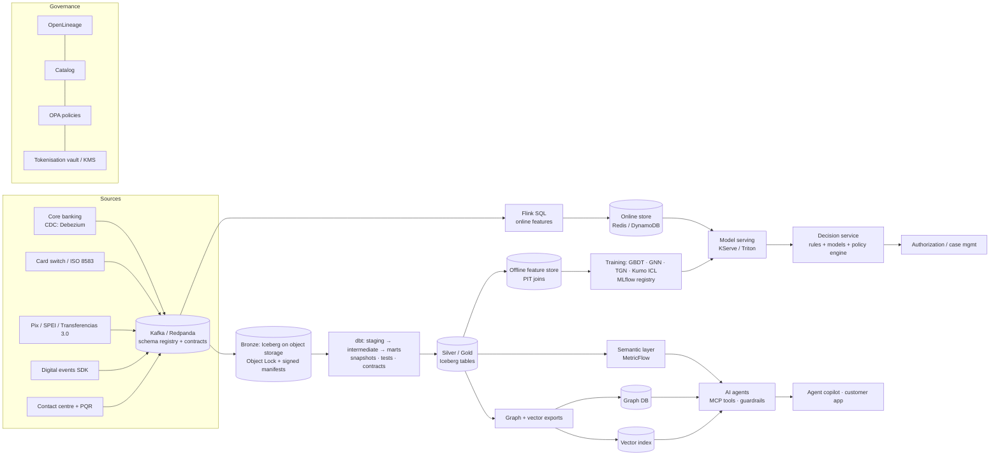
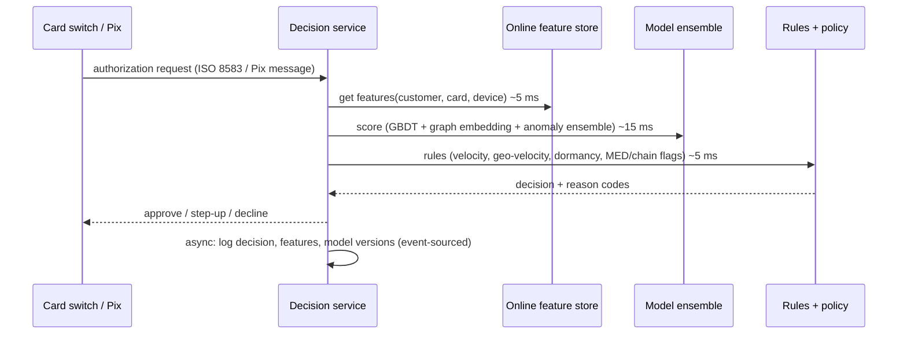

# 03 · Target architecture and design patterns

[← 02 compliance](02_compliance_and_regulation.md) · [index](README.md) · next: [04 SCD and integrity →](04_scd_adulteration_integrity.md)

## 3.1 Principles
1. **Bronze is evidence.** Raw data is immutable, fingerprinted and retained. Repairs happen downstream and are visible
   as flags, never as silent overwrites (`int_transactions_enriched` keeps `amount_usd_source` and
   `dq_r18_amount_usd_imputed`).
2. **One contract, two runtimes.** Every feature has one definition that runs in batch (dbt/SQL) and in streaming
   (Flink SQL), and a parity test proves they agree.
3. **Deterministic core, probabilistic edge.** Balances, eligibility, reasons and next-best-actions come from governed
   SQL. Models rank and prioritise. LLMs explain, retrieve and draft; they never compute money or decide credit.
4. **Data minimisation by construction.** Marts carry tokens; PII lives in a restricted zone and is re-joined only
   behind an authorization check.
5. **Everything is replayable.** Point-in-time correctness (SCD2, ASOF joins) lets any past decision be recomputed
   exactly.

## 3.2 Reference architecture

Component choices are defaults, not mandates; each has a managed alternative per cloud.

| layer | default | why |
|---|---|---|
| Streaming | Kafka (MSK / Confluent) or Redpanda + Schema Registry | ordering per key, replay, contracts at the edge |
| Stream processing | Flink SQL | event-time windows with watermarks; the same window semantics as the dbt features |
| Table format | Apache Iceberg | time travel, schema evolution, engine-neutral (Spark, Trino, DuckDB, Snowflake, BigQuery) |
| Transformation | dbt (dbt-duckdb locally; Spark/Trino/Snowflake/Databricks adapter in cloud) | tested, versioned SQL with lineage (ch. 05) |
| Orchestration | Dagster (asset-based, native dbt integration) or Airflow | asset lineage and freshness policies |
| Feature store | Feast (offline Iceberg, online Redis) | PIT joins offline, low-latency online, one registry |
| ML lifecycle | MLflow (registry, lineage to data versions) | model cards and approvals attach to versions |
| Serving | KServe / Triton (GBDT, GNN, TGN), vLLM / TensorRT-LLM / NIM (LLMs) | GPU batching, canary, shadow |
| Graph | Neo4j / Memgraph (OLTP) + PyG / DGL / cuGraph (training) | investigations and GraphRAG plus GNN training |
| Vector | pgvector (start) → Milvus / OpenSearch at scale | filtered retrieval with RLS by tenant and country |
| Quality and observability | dbt tests + Elementary; Evidently / NannyML for models | DQ SLOs and drift in one place |
| Lineage and catalog | OpenLineage + Marquez / DataHub; Unity / Polaris catalog | BCBS 239 evidence |
| Security | OPA (or Cedar), Vault/KMS, tokenisation vault, private networking | policy-as-code, keys never in code |

## 3.3 Design patterns mapped to the problems found

| pattern | problem it solves here | where |
|---|---|---|
| **Medallion (bronze/silver/gold)** | repairs vs evidence; a "backup" overwrote meaning | `platform/dbt/models/{staging,intermediate,marts}` |
| **Event sourcing + append-only audit log** | untraced re-scoring and consent changes | source systems emit change events with actor and reason; SCD2 is the analytical projection |
| **Transactional outbox** | dual writes between the core and Kafka lose or reorder events | core writes the change and the outbox row in one DB transaction; CDC publishes |
| **Idempotent consumers + exactly-once sinks** | duplicated or re-dated transactions (the 11,734 "clones") | dedupe on business key + event version; Flink two-phase-commit sinks |
| **Saga (orchestrated)** | disputes span card network, ledger, customer notice and regulator clock | dispute workflow (Temporal / Step Functions): provisional credit → evidence → chargeback → final; compensating steps |
| **CQRS** | case management needs fast reads of complex state | write model = events; read model = `mart_transaction_disputes`-like projections |
| **Hexagonal (ports and adapters)** | country-specific rails (SPEI, PSE/Bre-B, Transferencias 3.0, Pix) | one domain core, adapters per rail and regulator |
| **Strangler fig** | migrating legacy rules and the legacy `fraud_score` | new decision service shadows legacy, then takes traffic per segment |
| **Champion/challenger + shadow** | model changes in regulated decisions | challenger scores in shadow; promotion needs validation sign-off |
| **Circuit breaker + rule fallback** | model or LLM outage in authorization or service | timeout → deterministic rules (`mart_card_support.next_best_action` logic) |
| **Policy-as-code (PDP/PEP)** | which agent, user or model may see which data, per country | OPA decisions logged; agents call tools through a PEP |
| **Data contracts** | semantic FK breaks (R25/R26), vocabulary drift (Spanish labels in backup) | producer-owned schema + semantics + SLOs; breaking changes need versioning |
| **Feature-store dual path** | training/serving skew | one feature view → offline (dbt) + online (Flink), parity tested |

## 3.4 Real-time fraud path (latency budget about 100 ms p99)

Feature definitions come from `feat_fraud_realtime_pit` (ch. 06 §6.6). The Flink twin keeps the same windows. Because
labels here are not learnable, the first production version is **rules + the unsupervised ensemble from notebook 10**,
with the supervised layer added once confirmed-fraud labels exist.
