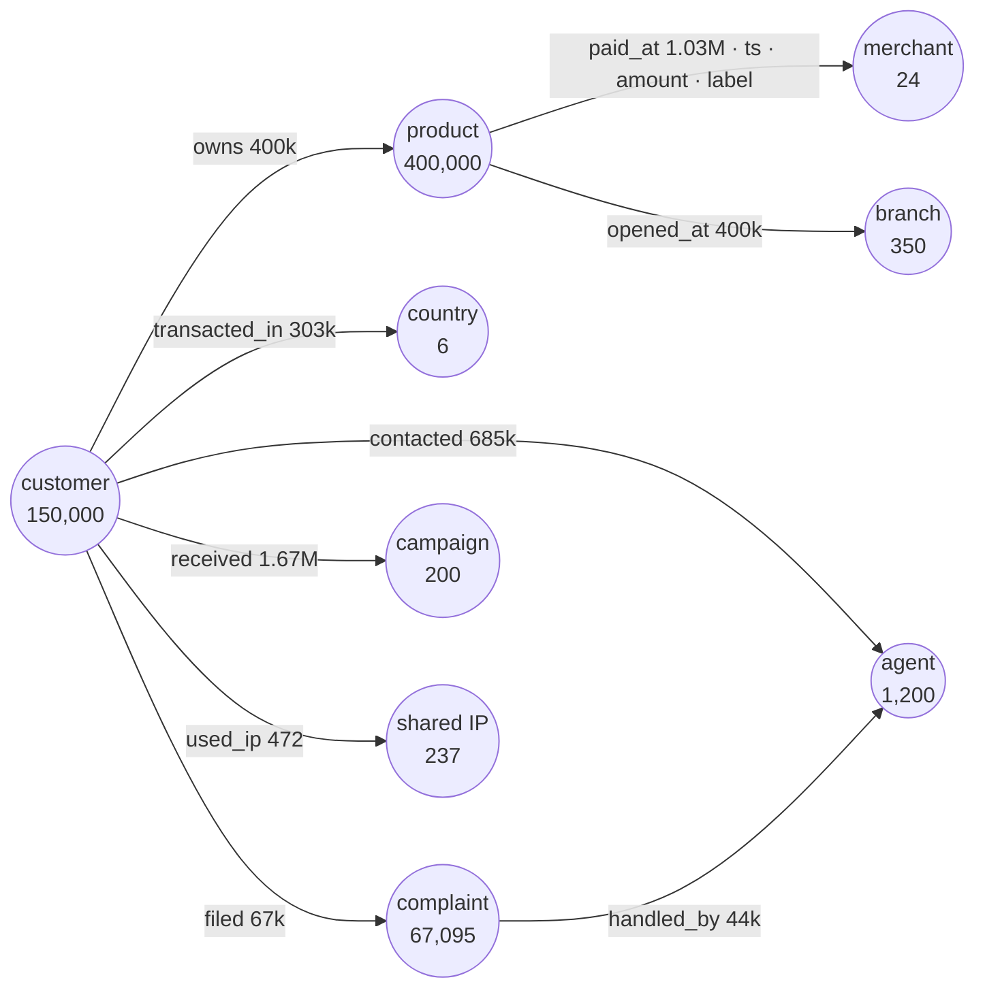

# 07 · Graphs, GNNs, GraphRAG and relational/tabular foundation models

[← 06 denormalized tables](06_denormalized_tables.md) · [index](README.md) · next: [08 ML, DL, AI and agents →](08_ml_dl_ai_agents.md)

## 7.1 Why graphs here
Bank data is relational by nature: customers own products, products pay merchants, customers contact agents and file
complaints, devices are shared. The highest-value fraud and AML patterns are **structural**: mule rings, shared
devices, fund chains, and merchants that are compromised points of purchase. Tabular features see one row; graphs see
the neighbourhood. Graph features are also **harder to game** than single-transaction features (ch. 08 §8.6). An
attacker can change an amount; changing a neighbourhood is much harder.

## 7.2 The exported heterogeneous graph
`export_graph_nodes` (619,112 nodes) and `export_graph_edges` (4,600,546 edges) are Parquet files under `data/lake/{graph,features,knowledge}/`.



Two edge types are **deliberately absent**: complaint → product (R25) and digital_event → product (R26). Their foreign
keys resolve to other customers' products, and a GNN would propagate that noise. Integrity findings decide graph
topology; that is the practical meaning of "data quality for ML".

**Honest assessment of this graph's signal.** There are only 24 merchants, 237 shared IPs and no transfer
counterparties, so the graph is shallow. It is a **pipeline rehearsal**: loaders, sampling, temporal splits and serving
can be built and tested now, and gain value the day counterparty and device data arrive.

## 7.3 GNN recipes

| task | graph | model | why |
|---|---|---|---|
| transaction fraud (edge classification) | customer–product–merchant, temporal | **TGN** (memory + temporal attention) or GraphSAGE embeddings → GBDT | sequences plus neighbourhood; embeddings + GBDT is the pattern in NVIDIA's financial-fraud blueprint |
| mule and account-takeover detection (node classification) | customer–device/IP–counterparty | **HGT** or **R-GCN** on a heterogeneous graph | typed relations matter: shared device ≠ shared merchant |
| AML ring discovery | fund-flow graph (§6.12) | community detection (Leiden) + GNN scoring + motif counts (fan-in/out, cycles) | rings are structural, not row-level |
| complaint / escalation risk (node regression) | customer neighbourhood | GraphSAGE / relational deep learning | aggregates of contacts, complaints and products without hand features |
| next product (link prediction) | customer–product types | LightGCN / PinSAGE | cross-sell with explainable neighbours |

**PyTorch Geometric loader** (heterogeneous, from the exports):

```python
import json, pandas as pd, torch
from torch_geometric.data import HeteroData

nodes = pd.read_parquet("data/lake/{graph,features,knowledge}/graph_nodes.parquet")
edges = pd.read_parquet("data/lake/{graph,features,knowledge}/graph_edges.parquet")
data = HeteroData()
idx = {t: dict(zip(g.node_id, g.node_idx)) for t, g in nodes.groupby("node_type")}
for t, g in nodes.groupby("node_type"):
    feats = pd.json_normalize(g.features.map(json.loads)).select_dtypes("number").fillna(0)   # numeric features only
    data[t].x = torch.tensor(feats.values, dtype=torch.float32)
for (s, r, d), g in edges.groupby(["src_type", "rel", "dst_type"]):
    g = g[g.src_id.isin(idx[s]) & g.dst_id.isin(idx[d])]
    data[s, r, d].edge_index = torch.tensor([g.src_id.map(idx[s]).values, g.dst_id.map(idx[d]).values])
    data[s, r, d].edge_time = torch.tensor(g.ts.astype("int64").values // 10**9)
# temporal neighbour sampling: NeighborLoader(..., time_attr="edge_time") so a node only sees its past
```

`export_temporal_tx_events` holds 1,029,234 customer→merchant interactions in TGN format: dense disjoint integer ids,
edge features, label, and out-of-time split. It plugs into PyG's `TGNMemory` / `TemporalData` directly. Only
transactions with a merchant are included; transfers have none.

**Graph hygiene rules:**
- use time-respecting neighbour sampling (no future edges);
- split by time, not by node;
- remove label-bearing edges from message passing during training (target-leak through edges);
- recompute embeddings on a schedule and version them like features.

## 7.4 Relational deep learning and foundation models (NVIDIA Kumo)
Two models published on Hugging Face (checked for this report):

| | **nvidia/Kumo-Relational** | **nvidia/Kumo-Tabular** |
|---|---|---|
| what | pretrained foundation model for classification/regression **across related tables** using **in-context learning**; builds on KumoRFM-2 and combines row embeddings with relational message passing | pretrained tabular foundation model for classification/regression via in-context learning |
| inputs | `x_context`, `y_context`, `x_query`, plus `related_context_tables` / `related_query_tables`, `num_estimators` | context features and labels plus query features (`TableTensor` from pandas) |
| training | none for a new task (in-context) | none (in-context) |
| runtime | CUDA GPU required | GPU optional (CPU fallback) |
| package / licence | `pip install structured-data-models` · OpenMDW 1.1 (fine-tunes TabICLv2 weights, BSD-3) | same package · OpenMDW 1.1 |

**How to use them here.** Use them as **learnability probes and strong baselines**, not as the production model.
In-context models answer one question within hours: *is there signal for this task in these tables?* That is exactly
the question this dataset forces (labels leak; history is missing).

1. `export_kumo_tabular_fraud` (48,529 rows: all 4,316 frauds + a 1 % sample of negatives, with weights and the
   out-of-time split). Expected result given ch. 01: about AUC 0.5, which confirms in one run that behaviour carries no
   label signal. Run the same probe on the backup realisation as a replicate test.
2. `export_kumo_relational_complaint90d` (1,103,598 customer × quarterly-cutoff rows, 3.6 % positives, label strictly
   after the cutoff). Related tables are transactions, contacts, digital events and products, **filtered to
   `ts < cutoff` per query row**. Compare against GBDT on `mart_customer_360`-style aggregates and against a
   RelBench-style GNN. If the foundation model matches GBDT with zero feature engineering, task-by-task feature work is
   not where the value lies.

```python
import pandas as pd, duckdb, sdm   # pip install structured-data-models  (CUDA required for KumoRelational)

ent = pd.read_parquet("data/lake/{graph,features,knowledge}/kumo_relational_complaint90d.parquet")
ctx, qry = ent[ent.split == "train"].sample(20_000, random_state=0), ent[ent.split == "test"].sample(5_000, random_state=0)

def related(rows: pd.DataFrame) -> dict[str, pd.DataFrame]:
    """Point-in-time related tables: for each entity row keep only events before its cutoff."""
    con = duckdb.connect("data/lake/lakehouse.duckdb", read_only=True)
    con.register("q", rows[["customer_id", "cutoff_ts"]])
    tx = con.sql("""select t.* exclude (fraud_score, is_fraud), q.cutoff_ts
                    from intermediate.int_transactions_enriched t join q using (customer_id)
                    where t.transaction_ts_utc < q.cutoff_ts""").df()
    cc = con.sql("""select i.*, q.cutoff_ts from marts.mart_cx_journey i join q using (customer_id)
                    where i.interaction_ts_utc < q.cutoff_ts""").df()
    return {"transactions": tx, "contacts": cc}
    # The expected container/keying of related tables is defined by structured-data-models: check the repo
    # (github.com/NVIDIA/structured-data-models) and adapt; the point-in-time filter is the part that must not change.

X = ["segment", "country_code", "tenure_days_at_cutoff"]
model = sdm.models.KumoRelational(task="classification", device="cuda")
probs = model(x_context=ctx[X], y_context=ctx.label_complaint_90d, x_query=qry[X],
              related_context_tables=related(ctx), related_query_tables=related(qry), num_estimators=8)
```

**Evaluation protocol (same for every candidate):**
- out-of-time test;
- AP and AUC with bootstrap CIs;
- calibration (ECE);
- latency and cost per 1 k predictions;
- stability on the backup realisation;
- explanation quality (can a reviewer see why?).

Report results in the model-risk inventory even when the answer is "no signal": that negative result is evidence for
the data-acquisition plan.

**Production caveats.** In-context inference cost scales with context size. Model-risk validation of a
foundation-model decision path needs reproducibility: pin weights, seeds and context sampling, and log everything.
Licences must be reviewed by legal before production use.

## 7.5 GraphRAG for banking

**Corpus.** `export_graphrag_entity_docs` holds 218,495 short **deterministic** documents: customers (tokenised),
complaints, agents and campaigns. They are generated by SQL, not by an LLM, so the index contains no hallucinations.
Example:

> Customer 873b6a85af6e267f (Basic segment, MX), status Active, tenure 228 days. Holds 4 products (Cuenta Ahorro,
> Cuenta Corriente, Tarjeta Crédito). Last 90 days: 3 transactions, inflow 0.0 USD, outflow 9090.0 USD, decline rate
> 0.333. … Data-quality notes: 4 products dated before registration.

`export_graphrag_triples` (4.4 M aggregated triples with provenance) loads into a property graph.

**Architecture.**
1. Entity graph in Neo4j or Memgraph.
2. Community detection (Leiden) on `community_key` seeds plus graph structure.
3. Community summaries generated offline by an LLM **with citations to source rows**.
4. Hybrid retrieval: vector + BM25 + graph traversal.
5. Answer synthesis that can only cite retrieved items.
6. Numbers come from SQL tools, not from text.

**Second corpus: regulation.** Laws, circulars and internal policies for MX/CO/AR/BR, chunked by article. Entities are
obligations, deadlines, thresholds, reports and authorities, linked to internal controls (ch. 02 §2.4). A compliance
copilot can then answer questions like *"which controls implement the MED 2.0 chain-blocking obligation and which
tables feed them?"* by traversing regulation → control → dbt model → test. That is GraphRAG over your own lineage graph:
`dbt docs` already produces the model graph.

**Security.**
- Customer text (complaint descriptions, transcripts, survey comments) is **untrusted input**. It is a prompt-injection
  channel and goes through sanitisation and a classifier before indexing.
- Retrieval applies row-level security by country, role and purpose.
- Re-identification of tokens happens only in the presentation layer after an authorization check.
