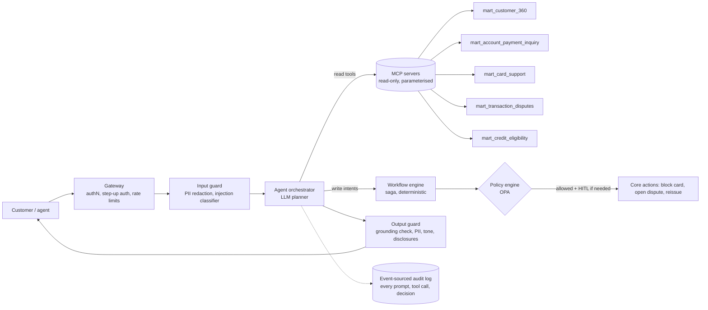

# 08 · ML, deep learning, AI engineering and agents

[← 07 graph and foundation models](07_graph_and_foundation_models.md) · [index](README.md) · next: [09 deployment →](09_deployment.md)

## 8.1 Use-case portfolio: coupled bundles, not isolated models
Needs that share data, controls and users should be built together. Each bundle reuses the same marts.

| bundle | needs solved together | shared assets | first release | learned models later |
|---|---|---|---|---|
| **B1 Service copilot** | account/payment inquiries, card support, dispute intake, complaint triage | `mart_account_payment_inquiry`, `mart_card_support`, `mart_transaction_disputes`, `mart_customer_360`, GraphRAG docs | agent-assist + customer chatbot answering from marts; deterministic NBA; dispute intake that captures `disputed_transaction_id` | escalation risk (`mart_cx_journey`), contact-reason classifier on real transcripts |
| **B2 Financial crime** | card/Pix fraud, AML monitoring, dispute evidence, MED 2.0 tracing | `feat_fraud_realtime_pit`, `mart_aml_customer_month`, graph exports, fund-flow graph | rules + unsupervised ensemble (notebook 10) + investigator copilot | GBDT on confirmed labels → TGN / HGT on counterparty graph |
| **B3 Credit lifecycle** | eligibility, pre-approval, limit management, collections | `feat_credit_eligibility_pit`, `mart_credit_eligibility`, `mart_collections_early_warning`, snapshots | transparent rules with reason codes; collections early-warning score | monotone GBDT scorecards; roll-rate models; contact-strategy uplift |
| **B4 Responsible growth** | consent compliance, campaign efficiency, cross-sell | `mart_campaign_compliance_uplift`, 360 | consent gate; suppress already-held products; holdout design | uplift learners; next-product link prediction |
| **B5 Data trust platform** | integrity, reconciliation, history, lineage | audit layer, snapshots, manifests | the controls of ch. 02 §2.4 in production | anomaly-detector CI; drift monitors |
| **B6 Compliance intelligence** | regulation tracking for 4 countries, control mapping, report drafting | regulation GraphRAG + dbt lineage graph | compliance copilot with citations | obligation-extraction fine-tune |

## 8.2 ML engineering practices
- **Feature store contract:** one definition, batch (dbt) and stream (Flink), parity-tested (ch. 06 §6.6).
- **Model registry with lineage:** each MLflow version records the dbt manifest hash, data snapshot IDs, feature-view
  versions and the label definition version.
- **Model cards and tiering:** purpose, data, metrics by segment, fairness, limits, owner, validator. Tier 1 covers
  credit decisions, fraud declines and AML alerts, and gets independent validation before production.
- **Detector CI.** Notebook 08 built an anomaly-injection harness (`eda/src/latam_eda/anomaly.py`, five anomaly types).
  Turn it into a **regression suite**: every detector or rule change must keep recall per anomaly type above floor
  values on injected data, and stay stable on the backup realisation. It is unit testing for unsupervised models.
- **Monitoring:** data drift (PSI per feature), prediction drift, alert volumes vs analyst capacity, label-delay-aware
  performance, and fairness drift. Thresholds come from the cost analysis (notebook 09 §7), not from defaults.
- **Release strategy:** shadow → champion/challenger on 5–10 % → full, with a rule-based fallback behind a circuit
  breaker.

## 8.3 Deep learning: where it earns its place
| technique | use | evidence so far | recommendation |
|---|---|---|---|
| AE / VAE | anomaly scoring + per-feature reconstruction error as explanation | VAE AP 0.45, but **lowest review cost** at a high budget (notebook 09) | keep as an ensemble member and explainer, not the primary detector |
| **Transaction sequence transformers** (self-supervised, masked-event pretraining on customer histories) | customer embeddings for fraud, credit, churn; few-shot downstream | not testable on 0.81 tx/customer-month | pretrain on real data; payment-sequence foundation models are where the industry is heading |
| **TGN / temporal GNN** | fraud and mule detection on interaction streams | export ready (1.03 M events) | build after counterparty data |
| TFT / N-HiTS | contact-centre and transaction volume forecasting, ATM cash | daily series have strong weekly seasonality (seasonal strength 0.86–0.92 for every table except digital events, 0.46) | quick win for workforce planning |
| Speech + NLP | transcription, intent, sentiment, PII redaction | transcripts are templates | fine-tune on real calls (es-MX/CO/AR, pt-BR accents) |

## 8.4 AI engineering (LLM applications)
- **Ground every number in a tool call.** The LLM receives mart rows (JSON) and writes the explanation. Answers cite the
  mart and the timestamp. Numeric claims are checked post-generation against the tool output; mismatch means no answer.
- **Text-to-SQL only over the semantic layer.** Agents query governed metrics and dimensions (MetricFlow), never raw
  tables. Generated SQL is parsed, checked against an allow-list and run read-only with row-level security.
- **Structured outputs** (JSON schema) for every machine-consumed response: dispute intake, complaint classification,
  NBA explanation.
- **Evaluation:** golden sets built from the marts, where answers are known exactly, plus adversarial sets. Metrics:
  faithfulness, numeric exactness, refusal correctness, latency, cost. Run in CI on every prompt or model change.
- **Observability:** OpenTelemetry traces of prompts, tool calls, retrieved documents and outputs, with PII redacted;
  retention aligned with record-keeping rules.

## 8.5 Agents: architecture and guardrails



Rules for agents in a regulated bank:
1. **Read tools are narrow and parameterised.** For example `get_card_support(product_id)` returns one row from
   `mart_card_support` for a product the authenticated customer owns. There is no free-form SQL and no cross-customer
   access. The ownership check is the semantic-integrity rule R25 applied at runtime.
2. **Write actions are intents, not calls.** The LLM proposes `{"intent": "reissue_card", "product_id": …,
   "reason": "REISSUE_CARD"}`. A deterministic workflow validates, applies policy (OPA), requires step-up auth or a
   human approval for money-moving or irreversible steps, and executes.
3. **Decisions stay deterministic.** Eligibility, limits, fees and refunds come from rules and models in the decision
   service. The LLM explains `decline_reasons`; it never invents or overrides them.
4. **Every tool call is audited:** actor, customer token, purpose, tool, parameters, result hash, model and prompt
   versions.
5. **Country and language are context**, not afterthoughts: es-MX / es-CO / es-AR / pt-BR prompts, product names,
   regulatory disclosures and complaint deadlines per country.

Agents to build, in order of value and safety:
1. agent-assist for contact-centre staff (human in the loop by design);
2. card-support self-service (reissue, travel notice, block/unblock with step-up);
3. dispute-intake agent (captures the disputed transaction, evidence and consent; starts the saga);
4. AML/fraud investigator copilot (summarises alerts, neighbourhood graph, prior cases; drafts the narrative, which the
   analyst signs);
5. data-quality steward agent (reads `dq_integrity_findings`, groups by root cause, opens tickets with evidence);
6. compliance copilot (regulation GraphRAG).

```python
# Sketch of a read-only MCP tool over a mart (FastMCP-style). Ownership is enforced in SQL, not by the LLM.
@mcp.tool()
def get_card_support(product_id: str, ctx: Context) -> dict:
    """Card status, recent declines by reason and the next best action for one of the caller's cards."""
    customer_id = ctx.auth.customer_id                       # from the authenticated session, never from the prompt
    row = db.execute("""select product_type, product_status, expiration_date, current_decline_streak,
                               declines_insufficient_funds_30d, declines_expired_30d, next_best_action
                        from marts.mart_card_support
                        where product_id = ? and customer_id = ?""", [product_id, customer_id]).fetchone()
    if row is None:
        raise ToolError("not found")                         # same error for "not yours" and "does not exist"
    audit.log(tool="get_card_support", customer=token(customer_id), product=product_id)
    return dict(row)
```

## 8.6 Adversarial robustness

**Tabular and graph models (fraud, AML, credit).**

| threat | example | defence |
|---|---|---|
| evasion | split amounts under thresholds; slow-walk velocity (the "low_and_slow" type HBOS and COPOD catch but Mahalanobis misses) | ensembles of diverse detectors (notebook 10); aggregate features over longer windows; graph features; monotonic constraints on risk-increasing features |
| adaptive probing | fraudsters test small transactions to learn thresholds | randomised thresholds within a band; rate-limit and monitor declines per device/merchant; never expose scores |
| poisoning | mislabelled chargebacks, insider label edits (cf. untraced re-scoring) | label provenance and SCD2 on labels; influence-function audits; robust losses; train only on verified labels |
| model extraction | many queries against a scoring API | no scores in responses, quotas, anomaly detection on query patterns |
| distribution shift | new rails (Pix), new country | drift monitors, conformal recalibration, champion/challenger |

Evaluate with **domain-constrained adversarial tests**: perturb only what an attacker controls (amount, timing,
merchant choice, device) and measure recall loss. Prefer models whose recall degrades gracefully.

**LLM systems (OWASP LLM Top 10, MITRE ATLAS).**
- **Indirect prompt injection** through complaint descriptions, transcripts, survey comments and emails. These enter
  context via RAG. Defences:
  - classify and sanitise at indexing;
  - wrap untrusted content with delimiters and instructions;
  - tool permissions independent of content;
  - the LLM cannot widen its own scope.
- **Data exfiltration:** retrieval with RLS, no cross-customer tools, output PII filters, and canary tokens in
  restricted documents.
- **Jailbreaks and policy evasion:** guard models (Llama Guard / NeMo Guardrails / Granite Guardian / Prompt Guard
  class) at input and output, plus a refusal-correctness eval set in Spanish and Portuguese.
- **Excessive agency:** intents plus a policy engine plus HITL (§8.5).
- **Red-teaming programme:** automated (garak, PyRIT, promptfoo) on every release, plus quarterly human red teams with
  banking-fraud scenarios such as social-engineering scripts, fake chargeback narratives and "I am the account owner's
  lawyer".

## 8.7 Post-training and fine-tuning your own models (using the cloud credits)

**When to fine-tune.** Use RAG and tools for **knowledge**; use fine-tuning for **behaviour**:
- tool-call reliability;
- Spanish/Portuguese regional register;
- regulatory tone;
- refusal policy;
- structured outputs;
- robustness to injection.

Keep facts out of weights. They change, and weights cannot be audited.

**Base models.** Pick current open-weight instruction models with permissive licences in the 7–14 B range for
latency-critical agents and 30–70 B for investigator and compliance copilots. Check Spanish/Portuguese quality and the
licence terms for commercial and financial use at build time. The landscape changes quarterly; decide by your own
evals, not by leaderboards.

**Data you can generate exactly from this warehouse.** Because the marts hold the ground truth, training data can be
**synthesised with verifiable answers**:
- (question, tool calls, mart rows, ideal answer) tuples for inquiries, cards and disputes;
- refusal cases (other customer's product, missing auth);
- injection cases (malicious complaint text);
- multilingual paraphrases.

**Pipeline.**
1. **SFT** with LoRA/QLoRA on curated and synthetic dialogues: tool use, JSON schemas, regional Spanish and
   Portuguese, disclosures.
2. **Preference optimisation** (DPO / ORPO / KTO) on pairs ranked by compliance and CX reviewers: grounded vs
   ungrounded, correct vs incorrect refusals.
3. **RL with verifiable rewards** (GRPO-family) where the reward is computable: tool call valid and owned, numbers
   match mart values exactly, JSON validates, no PII leaked, and a refusal happens when required. This is the most
   effective way to harden agents against hallucinated amounts and against injections (include adversarial episodes in
   the RL mix).
4. **Safety alignment and adversarial training:** red-team transcripts become training data; train the guard model on
   your own attack corpus.
5. **Evaluation gates:** domain golden sets, numeric exactness, refusal precision/recall, injection success rate,
   regional-language quality, plus general-capability regression.

**Quantisation and serving.**
- AWQ / GPTQ INT4 for 7–14 B on L4/L40S-class GPUs.
- FP8 (Hopper) or FP4 (Blackwell) for larger models.
- GGUF for on-device or air-gapped demos.
- Serve with vLLM / SGLang / TensorRT-LLM (or NIM containers) behind the gateway.
- Validate that quantisation does not degrade refusal and injection metrics. Safety behaviour is often the first thing
  to regress.

**Indicative compute** (order of magnitude; verify with a pilot):
- LoRA SFT of an 8 B model on tens of thousands of dialogues: a few GPU-hours on one H100-class GPU.
- RL fine-tuning of 7–14 B: tens to hundreds of GPU-hours.
- 70 B QLoRA: multi-GPU nodes for a day or more.

Tabular models (GBDT) and GNNs on this data volume need modest GPU or CPU. The credits are best spent on LLM
post-training, foundation-model probes, GNN/TGN training at real scale and the red-team loop.

## 8.8 Interpretability and auditability by model family
| family | explanation | audit artefact |
|---|---|---|
| rules | the rule and threshold that fired | reason code + rule version |
| GBDT | TreeSHAP per decision; monotone constraints; partial dependence | stored top-k SHAP with each decision |
| scorecards | WoE points per attribute | points table version |
| anomaly ensemble | per-detector rank, feature-level robust z, AE per-feature error (notebook 09) | detector votes stored with the alert |
| GNN | GNNExplainer / PGExplainer subgraph, neighbourhood summary | explanation subgraph IDs |
| foundation models (ICL) | context examples nearest to the query; ablations | pinned weights, context sample, seed |
| LLM agents | tool trace + cited rows; never "the model thinks" | event-sourced conversation log |

Counterfactual explanations ("you would be eligible if your 3-month average inflow were above X") come straight from
the rule parameters in `mart_credit_eligibility`. They are more useful to customers and regulators than SHAP plots.
