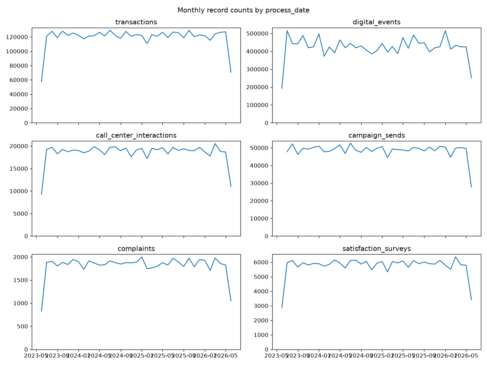
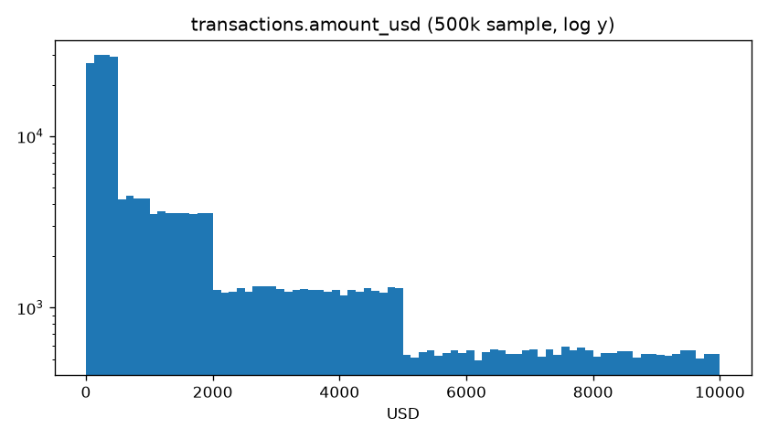
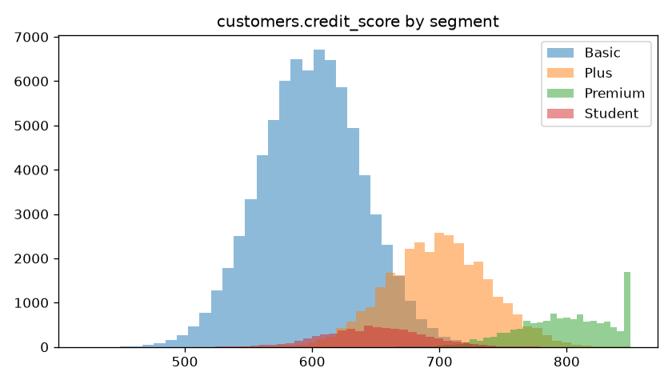

# LATAM Bank – initial EDA

## Row counts, duplicate primary keys, date range

`documented` comes from the dataset summary PDF; `dup_pk` = rows − distinct primary keys.

| table                    |     rows |   documented |   diff_% |   dup_pk |   dup_% | process_date_range      |
|:-------------------------|---------:|-------------:|---------:|---------:|--------:|:------------------------|
| transactions             |  4425008 |      5000000 |    -11.5 |        0 |       0 | 2023-06-17 → 2026-06-17 |
| digital_events           | 15620994 |     10000000 |     56.2 |        0 |       0 | 2023-06-17 → 2026-06-17 |
| call_center_interactions |   686296 |       800000 |    -14.2 |        0 |       0 | 2023-06-17 → 2026-06-17 |
| call_transcripts         |   171321 |       200000 |    -14.3 |        0 |       0 | 2023-06-17 → 2026-06-17 |
| campaign_sends           |  1746801 |      2000000 |    -12.7 |        0 |       0 | 2023-07-01 → 2026-06-17 |
| complaints               |    67095 |        80000 |    -16.1 |        0 |       0 | 2023-06-17 → 2026-06-17 |
| satisfaction_surveys     |   212759 |       250000 |    -14.9 |        0 |       0 | 2023-06-17 → 2026-06-17 |
| customers                |   150000 |       150000 |      0   |        0 |       0 |                         |
| products                 |   400000 |       400000 |      0   |        0 |       0 |                         |
| branches                 |      350 |          350 |      0   |        0 |       0 |                         |
| service_agents           |     1200 |         1200 |      0   |        0 |       0 |                         |
| marketing_campaigns      |      200 |          200 |      0   |        0 |       0 |                         |
| daily_exchange_rates     |    13164 |         3000 |    338.8 |      nan |     nan | 2023-06-17 → 2026-06-17 |

## Nulls – transactions

Only columns with nulls.

| column               |   null_% |
|:---------------------|---------:|
| latitude             |     80.6 |
| longitude            |     80.6 |
| merchant_category    |     76.8 |
| merchant_name        |     76.7 |
| branch_id            |     68.6 |
| transaction_category |     60.9 |
| amount_usd           |     57.3 |
| fraud_score          |     20   |
| transaction_city     |     10   |
| response_code        |      5   |

## Nulls – digital_events

Only columns with nulls.

| column           |   null_% |
|:-----------------|---------:|
| event_value      |     94.9 |
| utm_campaign     |     94.6 |
| utm_medium       |     94.6 |
| utm_source       |     94.6 |
| referrer         |     93.3 |
| product_id       |     90.8 |
| duration_seconds |     63.7 |
| browser          |     62   |
| app_version      |     43   |
| ip_city          |     28   |
| customer_id      |     24   |
| element_id       |     15   |
| action           |     10   |
| platform         |      5   |
| page_title       |      5   |
| ip_address       |      5   |
| page_url         |      5   |

## Nulls – call_center_interactions

Only columns with nulls.

| column                   |   null_% |
|:-------------------------|---------:|
| mentioned_products       |     60   |
| wait_time_seconds        |     30   |
| customer_detected_accent |     29.8 |
| agent_used_accent        |     29.8 |
| duration_seconds         |     14   |

## Nulls – campaign_sends

Only columns with nulls.

| column           |   null_% |
|:-----------------|---------:|
| conversion_date  |     99.4 |
| conversion_value |     99.4 |
| click_date       |     94.4 |
| click_count      |     94.4 |
| failure_reason   |     94.3 |
| open_device      |     74.9 |
| open_country     |     74.9 |
| open_date        |     72.1 |
| subject          |     68   |
| was_opened       |     27.7 |
| send_cost        |     15   |
| template_used    |     10   |

## Nulls – complaints

Only columns with nulls.

| column                  |   null_% |
|:------------------------|---------:|
| origin_interaction_id   |    100   |
| closing_date            |     96.3 |
| resolution_satisfaction |     96.3 |
| compensation_granted    |     93.1 |
| resolution              |     77.2 |
| resolution_date         |     77.1 |
| resolution_days         |     77.1 |
| related_branch_id       |     71.4 |
| claimed_amount          |     67.6 |
| currency                |     67.5 |
| first_response_date     |     39.1 |
| assigned_agent_id       |     34.5 |
| assignment_date         |     34.5 |
| affected_product_id     |     33.6 |
| subcategory             |     10   |

## Nulls – satisfaction_surveys

Only columns with nulls.

| column                 |   null_% |
|:-----------------------|---------:|
| question_3_response    |     81.2 |
| question_3_text        |     81.1 |
| nps_category           |     71.6 |
| question_2_text        |     61.8 |
| question_2_response    |     61.7 |
| open_comments          |     52.4 |
| comment_sentiment      |     52.4 |
| question_1_text        |     43   |
| question_1_response    |     43   |
| campaign_response_rate |     15.1 |

## Nulls – customers

Only columns with nulls.

| column                   |   null_% |
|:-------------------------|---------:|
| landline_phone           |     50   |
| detected_accent          |     29.9 |
| estimated_monthly_income |     20   |
| credit_score             |     15   |
| education_level          |     12   |
| postal_code              |     10   |
| occupation               |     10   |
| marital_status           |      8   |
| address                  |      4.9 |
| mobile_phone             |      3.1 |
| email                    |      2   |

## Nulls – products

Only columns with nulls.

| column                |   null_% |
|:----------------------|---------:|
| credit_limit          |     68.7 |
| days_past_due         |     68.7 |
| expiration_date       |     66.7 |
| last_transaction_date |     23.6 |
| interest_rate         |     10   |

## Nulls – branches

Only columns with nulls.

_empty_

## Nulls – service_agents

Only columns with nulls.

| column                     |   null_% |
|:---------------------------|---------:|
| specialty                  |     39.7 |
| assigned_branch_id         |     30.6 |
| avg_csat                   |     11.2 |
| total_monthly_interactions |      9.3 |
| phone                      |      5.8 |

## Nulls – marketing_campaigns

Only columns with nulls.

| column                   |   null_% |
|:-------------------------|---------:|
| target_country           |     55.5 |
| target_segment           |     39.5 |
| description              |     19.5 |
| budget                   |     15.5 |
| promoted_product         |     11   |
| expected_conversion_rate |      7   |

## Nulls – daily_exchange_rates

Only columns with nulls.

_empty_

## Referential integrity

| child                                | parent                                  |   orphans |   orphan_% |
|:-------------------------------------|:----------------------------------------|----------:|-----------:|
| transactions.customer_id             | customers.customer_id                   |         0 |          0 |
| transactions.product_id              | products.product_id                     |         0 |          0 |
| transactions.branch_id               | branches.branch_id                      |         0 |          0 |
| products.customer_id                 | customers.customer_id                   |         0 |          0 |
| digital_events.customer_id           | customers.customer_id                   |         0 |          0 |
| call_center_interactions.customer_id | customers.customer_id                   |         0 |          0 |
| call_center_interactions.agent_id    | service_agents.agent_id                 |         0 |          0 |
| call_transcripts.interaction_id      | call_center_interactions.interaction_id |         0 |          0 |
| satisfaction_surveys.interaction_id  | call_center_interactions.interaction_id |         0 |          0 |
| complaints.customer_id               | customers.customer_id                   |         0 |          0 |
| campaign_sends.campaign_id           | marketing_campaigns.campaign_id         |         0 |          0 |
| campaign_sends.customer_id           | customers.customer_id                   |         0 |          0 |

## Distribution – customers.country

| value     |     n |   pct |
|:----------|------:|------:|
| México    | 74907 | 49.94 |
| Colombia  | 45251 | 30.17 |
| Argentina | 29842 | 19.89 |

## Distribution – customers.segment

| value   |     n |   pct |
|:--------|------:|------:|
| Basic   | 89756 | 59.84 |
| Plus    | 37547 | 25.03 |
| Premium | 15207 | 10.14 |
| Student |  7490 |  4.99 |

## Distribution – customers.customer_status

| value     |      n |   pct |
|:----------|-------:|------:|
| Active    | 127700 | 85.13 |
| Inactive  |  14914 |  9.94 |
| Suspended |   4407 |  2.94 |
| Closed    |   2979 |  1.99 |

## Distribution – customers.detected_accent

| value     |     n |   pct |
|:----------|------:|------:|
| mexican   | 52505 | 35    |
| nan       | 44817 | 29.88 |
| colombian | 31666 | 21.11 |
| argentine | 21012 | 14.01 |

## Distribution – customers.document_type

| value     |      n |   pct |
|:----------|-------:|------:|
| DNI       | 104749 | 69.83 |
| CE        |  15150 | 10.1  |
| Pasaporte |  15062 | 10.04 |
| CC        |  15039 | 10.03 |

## Distribution – products.product_type

| value                |      n |   pct |
|:---------------------|-------:|------:|
| Cuenta Ahorro        | 120203 | 30.05 |
| Tarjeta Crédito      | 100102 | 25.03 |
| Cuenta Corriente     |  99979 | 24.99 |
| Tarjeta Débito       |  39938 |  9.98 |
| Préstamo Personal    |  19960 |  4.99 |
| Préstamo Hipotecario |  11910 |  2.98 |
| Inversión            |   5859 |  1.46 |
| Seguro               |   2049 |  0.51 |

## Distribution – products.currency

| value   |      n |   pct |
|:--------|-------:|------:|
| USD     | 220501 | 55.13 |
| COP     | 107975 | 26.99 |
| ARS     |  71524 | 17.88 |

## Distribution – products.product_status

| value     |      n |   pct |
|:----------|-------:|------:|
| Active    | 339965 | 84.99 |
| Closed    |  32039 |  8.01 |
| Blocked   |  19935 |  4.98 |
| Suspended |   8061 |  2.02 |

## Distribution – transactions.transaction_type

| value      |       n |   pct |
|:-----------|--------:|------:|
| Purchase   | 1083406 | 24.48 |
| Withdrawal |  964673 | 21.8  |
| Transfer   |  896438 | 20.26 |
| Payment    |  738964 | 16.7  |
| Deposit    |  609409 | 13.77 |
| Adjustment |  132118 |  2.99 |

## Distribution – transactions.channel

| value    |       n |   pct |
|:---------|--------:|------:|
| POS      | 1548161 | 34.99 |
| ATM      | 1328334 | 30.02 |
| Web      |  663445 | 14.99 |
| App      |  663414 | 14.99 |
| Branch   |  132495 |  2.99 |
| Transfer |   89159 |  2.01 |

## Distribution – transactions.currency

| value   |       n |   pct |
|:--------|--------:|------:|
| USD     | 2437979 | 55.1  |
| COP     | 1194444 | 26.99 |
| ARS     |  792585 | 17.91 |

## Distribution – transactions.transaction_country

| value     |       n |   pct |
|:----------|--------:|------:|
| México    | 2105794 | 47.59 |
| Colombia  | 1289503 | 29.14 |
| Argentina |  867561 | 19.61 |
| USA       |   40621 |  0.92 |
| Spain     |   40542 |  0.92 |
| Mexico    |   40515 |  0.92 |
| Brazil    |   40472 |  0.91 |

## Distribution – transactions.transaction_status

| value    |       n |   pct |
|:---------|--------:|------:|
| Approved | 4070681 | 91.99 |
| Declined |  221234 |  5    |
| Pending  |   88343 |  2    |
| Reversed |   44750 |  1.01 |

## Distribution – transactions.response_code

|   value |       n |   pct |
|--------:|--------:|------:|
|       0 | 3867312 | 87.4  |
|     nan |  221033 |  5    |
|      14 |   84472 |  1.91 |
|      51 |   84179 |  1.9  |
|       5 |   84141 |  1.9  |
|      54 |   83871 |  1.9  |

## Distribution – transactions.merchant_category

| value         |       n |   pct |
|:--------------|--------:|------:|
| nan           | 3396215 | 76.75 |
| Food          |  256846 |  5.8  |
| Services      |  205124 |  4.64 |
| Other         |  155029 |  3.5  |
| Transport     |  154931 |  3.5  |
| Entertainment |  153960 |  3.48 |
| Health        |  102903 |  2.33 |

## Distribution – digital_events.event_type

| value      |       n |   pct |
|:-----------|--------:|------:|
| PageView   | 5972564 | 38.23 |
| Click      | 3585034 | 22.95 |
| Login      | 2434770 | 15.59 |
| Logout     | 2433612 | 15.58 |
| FormSubmit |  596908 |  3.82 |
| Error      |  358723 |  2.3  |
| Purchase   |  239383 |  1.53 |

## Distribution – digital_events.channel

| value       |       n |   pct |
|:------------|--------:|------:|
| Android App | 5476164 | 35.06 |
| iOS App     | 3899497 | 24.96 |
| Desktop Web | 3128851 | 20.03 |
| Mobile Web  | 3116482 | 19.95 |

## Distribution – call_center_interactions.interaction_type

| value         |      n |   pct |
|:--------------|-------:|------:|
| Inbound Call  | 480678 | 70.04 |
| Outbound Call | 102572 | 14.95 |
| Chat          |  68691 | 10.01 |
| Email         |  27543 |  4.01 |
| Video         |   6812 |  0.99 |

## Distribution – call_center_interactions.reason_category

| value         |      n |   pct |
|:--------------|-------:|------:|
| Transaccional | 240056 | 34.98 |
| Producto      | 150863 | 21.98 |
| Queja         | 117021 | 17.05 |
| Técnico       | 102899 | 14.99 |
| Comercial     |  54879 |  8    |
| Retención     |  20578 |  3    |

## Distribution – call_center_interactions.detected_sentiment

| value        |      n |   pct |
|:-------------|-------:|------:|
| Neutral      | 459712 | 66.98 |
| Negativo     |  94322 | 13.74 |
| Positivo     |  75562 | 11.01 |
| Muy Negativo |  37727 |  5.5  |
| Muy Positivo |  18973 |  2.76 |

## Distribution – campaign_sends.send_channel

| value    |      n |   pct |
|:---------|-------:|------:|
| Email    | 620195 | 35.5  |
| SMS      | 432283 | 24.75 |
| WhatsApp | 349144 | 19.99 |
| Push     | 290650 | 16.64 |
| Voice    |  54529 |  3.12 |

## Distribution – campaign_sends.send_status

| value   |       n |   pct |
|:--------|--------:|------:|
| Sent    | 1642044 | 94    |
| Failed  |   52306 |  2.99 |
| Bounced |   34900 |  2    |
| Blocked |   17551 |  1    |

## Distribution – complaints.category

| value        |     n |   pct |
|:-------------|------:|------:|
| Transactions | 13580 | 20.24 |
| Fees         | 13553 | 20.2  |
| Technical    | 13407 | 19.98 |
| Branch       | 13361 | 19.91 |
| Service      | 13194 | 19.66 |

## Distribution – complaints.status

| value      |     n |   pct |
|:-----------|------:|------:|
| In Process | 26823 | 39.98 |
| Open       | 20125 | 29.99 |
| Resolved   | 13512 | 20.14 |
| Escalated  |  3321 |  4.95 |
| Closed     |  2609 |  3.89 |
| Rejected   |   705 |  1.05 |

## Distribution – complaints.priority

| value    |     n |   pct |
|:---------|------:|------:|
| Medium   | 33439 | 49.84 |
| Low      | 20411 | 30.42 |
| High     |  9890 | 14.74 |
| Critical |  3355 |  5    |

## Distribution – satisfaction_surveys.survey_type

| value   |      n |   pct |
|:--------|-------:|------:|
| CSAT    | 127856 | 60.09 |
| NPS     |  63668 | 29.92 |
| CES     |  21235 |  9.98 |

## Distribution – satisfaction_surveys.nps_category

| value     |      n |   pct |
|:----------|-------:|------:|
| nan       | 152365 | 71.61 |
| Detractor |  45007 | 21.15 |
| Passive   |  15387 |  7.23 |

## Distribution – call_transcripts.detected_accent

| value     |     n |   pct |
|:----------|------:|------:|
| nan       | 63083 | 36.82 |
| mexican   | 54152 | 31.61 |
| colombian | 32284 | 18.84 |
| argentine | 21802 | 12.73 |

## Distribution – call_transcripts.detected_language

| value   |      n |   pct |
|:--------|-------:|------:|
| es      | 171321 |   100 |

## Numeric summaries

| column                                     |     min |      p01 |    median |           mean |            p99 |            max |
|:-------------------------------------------|--------:|---------:|----------:|---------------:|---------------:|---------------:|
| transactions.amount_usd                    |    5    |    22.26 |    466.69 | 1675.07        | 9506.71        | 9999.96        |
| transactions.fraud_score                   |    0    |     0.3  |     15.01 |   15.03        |   29.72        |   99.99        |
| customers.credit_score                     |  422    |   514    |    631    |  647.1         |  850           |  850           |
| customers.estimated_monthly_income         | 5100.28 | 10309.8  | 342974    |    5.89596e+06 |    8.59495e+07 |    1.11895e+08 |
| products.current_balance                   |    0    |     0    |   7511.25 |    6.39848e+06 |    6.18493e+07 |    8.81512e+08 |
| call_center_interactions.duration_seconds  |   30    |    74    |    291    |  321.45        |  762           | 1204           |
| call_center_interactions.wait_time_seconds |    0    |     0    |    119    |  119.94        |  259           |  424           |
| satisfaction_surveys.main_score            |    1    |     1    |      3    |    3.53        |    7           |    7           |
| complaints.resolution_days                 |    1    |     1    |     16    |   15.6         |   30           |   30           |

## Fraud by transaction type / channel

| transaction_type   | channel   |      n |   fraud |   fraud_pct |   avg_score |
|:-------------------|:----------|-------:|--------:|------------:|------------:|
| Purchase           | POS       | 378515 |     361 |       0.095 |        15   |
| Purchase           | ATM       | 325993 |     321 |       0.098 |        15   |
| Withdrawal         | POS       | 337693 |     316 |       0.094 |        15   |
| Withdrawal         | ATM       | 289518 |     300 |       0.104 |        15   |
| Transfer           | POS       | 313434 |     269 |       0.086 |        15   |
| Transfer           | ATM       | 268811 |     251 |       0.093 |        15.1 |
| Payment            | POS       | 258573 |     237 |       0.092 |        15   |
| Payment            | ATM       | 221647 |     231 |       0.104 |        15   |
| Deposit            | POS       | 213678 |     231 |       0.108 |        15   |
| Deposit            | ATM       | 182775 |     186 |       0.102 |        15   |
| Purchase           | App       | 162618 |     184 |       0.113 |        15.1 |
| Purchase           | Web       | 162269 |     154 |       0.095 |        15   |
| Withdrawal         | Web       | 144757 |     145 |       0.1   |        15.1 |
| Withdrawal         | App       | 144402 |     144 |       0.1   |        15   |
| Payment            | Web       | 111215 |     125 |       0.112 |        15   |

## Campaign funnel by channel

| send_channel   |   sends |   delivered_pct |   opened_pct |   clicked_pct |   conv_pct |   total_cost |
|:---------------|--------:|----------------:|-------------:|--------------:|-----------:|-------------:|
| Email          |  620195 |            94   |         30   |           5.7 |       0.56 |         2903 |
| SMS            |  432283 |            94   |         49.9 |           9.4 |       0.94 |        36704 |
| WhatsApp       |  349144 |            94   |        nan   |           0   |       0    |        14825 |
| Push           |  290650 |            94   |         40.1 |           7.6 |       0.77 |          136 |
| Voice          |   54529 |            93.8 |        nan   |           0   |       0    |         9277 |

## Resolution & sentiment by reason

| reason_category   |      n |   resolved_pct |   avg_sentiment |   avg_dur_s |
|:------------------|-------:|---------------:|----------------:|------------:|
| Transaccional     | 240056 |           91.5 |           -0    |         221 |
| Producto          | 150863 |           89.6 |           -0.04 |         266 |
| Queja             | 117021 |           43.6 |           -0.07 |         435 |
| Técnico           | 102899 |           69.9 |           -0.07 |         360 |
| Comercial         |  54879 |           65.2 |           -0.07 |         540 |
| Retención         |  20578 |           60.2 |           -0.07 |         479 |

## Figures

